# Quantitative Portfolio Management (Term Test II) - Complete Study Source

This document is designed as a one-stop, first-principles study source for Unit 4, Unit 5, and Unit 6.
It is not revision-only shorthand. It teaches concepts from basics, then builds into formulas, intuition, and solved numericals.

Syllabus scope covered:
- Unit 4: Portfolio Optimization in Practice
- Unit 5: Beyond Diversification (Portfolio Insurance and CPPI)
- Unit 6: Portfolio Revision, Evaluation, FX Risk, and Bond Portfolio Strategies

Primary source pool:
- All available PPTX/PPT/DOCX/PDF files inside UNIT 4, UNIT 5, UNIT 6
- Embedded images extracted and OCR-read from those files

---

## How To Study This Document

Study flow for each topic:
1. Meaning and intuition (what and why)
2. Formula and terms (how to compute)
3. Interpretation (what answer means)
4. Worked examples (source-based)

If you are seeing these topics for the first time, follow this order:
- Unit 4 first (diversification and risk mechanics)
- Unit 5 next (CPPI and downside control)
- Unit 6 last (evaluation measures and fixed-income/FX overlays)

---

## Unit 4: Portfolio Optimization in Practice

### 4.1 Diversification and Optimization Methods

#### A. Naive Diversification (1/N Rule)

Meaning:
- Naive diversification means dividing capital equally across all selected assets.
- You do not estimate expected return, covariance, or optimization weights.
- If there are N assets, each gets exactly 1/N of capital.

Why it exists:
- In real markets, expected returns and correlations are estimated with error.
- Highly optimized portfolios can overfit noisy estimates and become unstable.
- Equal-weighting is robust, transparent, and behaviorally easier to execute.

Core formula:
- Weight per asset = 1/N
- Portfolio return = sum(w_i x R_i)

What it captures well:
- Baseline diversification.
- Low implementation complexity.
- Reduced model risk from unstable parameter estimation.

What it misses:
- Risk asymmetry across assets.
- Correlation structure.
- Investor-specific risk constraints.

Source evidence:
- Definition, formula, rationale, pros/cons, behavioral-bias interpretation are present in UNIT 4/1 Naive Diversification slides.

##### Solved examples (from source content)

Example 1 (equal allocation):
- Total investment = INR 1,00,000
- Assets = 5
- Weight per asset = 1/5 = 20%
- Allocation per asset = INR 20,000
Interpretation: pure equal-weight capital split.

Example 2 (portfolio return from equal weights):
- 4 stocks, equal weight 25% each
- Returns = 8%, 12%, 10%, 14%
- Portfolio return = 0.25x8 + 0.25x12 + 0.25x10 + 0.25x14 = 11%

Example 3 (return in rupee terms):
- Total capital = INR 3,00,000
- 5 assets, equal allocation => INR 60,000 each
- Mean portfolio return shown in source = 11%
- Total rupee return = 3,00,000 x 0.11 = INR 33,000

Example 4 (empirical comparison linkage):
- Equal weight used as diversification benchmark in optimization-vs-diversification deck.
- Source case reports equal-weight expected return near 11.34% versus concentrated optimized portfolio near 12.20%.
- Interpretation: higher expected return may come with concentration risk.

---

#### B. Scientific Diversification

Meaning:
- Scientific diversification uses statistics to construct portfolios.
- Inputs include expected return, standard deviation (risk), covariance/correlation.
- Goal is not just “many assets,” but “right combination of co-movements.”

Key principle:
- Best diversification comes from combining assets with low or negative correlations.
- Two risky assets can reduce total portfolio risk when they do not move together.

Why this is better than random splitting:
- Random splitting may accidentally cluster risk in one hidden factor (sector, macro sensitivity).
- Scientific diversification explicitly checks relationships among assets.

What students must internalize:
- Diversification is about risk interaction, not asset count.
- Correlation drives diversification benefit.

Practical sequence:
1. Estimate expected returns.
2. Estimate risk (sigma or variance).
3. Estimate pairwise correlations/covariance.
4. Construct candidate portfolios.
5. Choose efficient risk-return combination.

Source evidence:
- Full conceptual path and applications are described in UNIT 4/2 Scientific Diversification.

---

### 4.2 Risk-Based Approaches

#### A. Measuring Risk Contributions

Core idea:
- Portfolio risk is not only “how risky each asset is.”
- It is “how much each asset contributes to total portfolio risk.”

Three measures:
1. Marginal Contribution to Risk (MCR_i):
   MCR_i = Cov(R_i, R_p) / sigma_p
   Meaning: how much total risk changes for a small weight increase in asset i.

2. Total Risk Contribution (TRC_i):
   TRC_i = w_i x MCR_i
   Meaning: absolute risk contribution of asset i.

3. Percentage Risk Contribution (PRC_i):
   PRC_i = TRC_i / sigma_p
   Meaning: contribution share of total risk.

Why it matters:
- Two assets can have similar variance but different risk contribution due to covariance with portfolio.
- Risk concentration can hide in a single heavily correlated position.

##### Solved examples (source-based)

Example 1 (two-asset case):
- w_A=0.60, Cov(A,p)=0.018, sigma_p=0.12
- w_B=0.40, Cov(B,p)=0.012, sigma_p=0.12
- MCR_A = 0.018/0.12 = 0.15
- MCR_B = 0.012/0.12 = 0.10
- TRC_A = 0.60x0.15 = 0.09
- TRC_B = 0.40x0.10 = 0.04
- PRC computed from TRC/sigma_p in source slides.
Interpretation: Asset A dominates risk share.

Example 2 (alternate two-asset setup):
- sigma_p=0.10, Cov(A,p)=0.018, Cov(B,p)=0.012, same weights.
- MCR_A=0.18, MCR_B=0.12
- TRC_A=0.108, TRC_B=0.048
- PRC from TRC/sigma_p indicates strong A concentration.

Example 3 (three-asset fund case):
- Equity/Bond/Commodity with given covariances and weights in source.
- Source computes MCR, TRC, PRC and shows equity highest risk share.
- Interpretation: rebalance needed if target is balanced risk profile.

Example 4 (risk-control decision):
- Use PRC table to identify breach against target risk budget.
- Action: reduce high PRC asset weight and increase under-allocated defensive assets.

---

#### B. Risk Budgeting

Meaning:
- Capital budgeting allocates money.
- Risk budgeting allocates permissible risk.
- Portfolio is designed so risk usage matches planned budget shares.

Framework elements from source:
- Risk appetite: total risk willingness.
- Risk tolerance: acceptable fluctuations.
- Risk capacity: ability to absorb losses.
- Monitoring and review cycle.

Risk-budgeting process:
1. Identify risks.
2. Assess and quantify them.
3. Set appetite/tolerance.
4. Allocate risk budget.
5. Review and adjust.

Why this is powerful:
- Prevents one asset from consuming most risk.
- Keeps portfolio aligned with investor objective and constraints.

##### Solved examples (source-based)

Example 1 (equity-bond-commodity):
- Risk contribution = weight x volatility
- Equity: 0.50x0.20=0.10
- Bond: 0.30x0.10=0.03
- Commodity: 0.20x0.15=0.03
- Total risk=0.16
- Risk shares: 62.5%, 18.75%, 18.75%

Example 2 (capital-to-risk decomposition):
- Portfolio value INR 1,00,000 with A/B/C allocations.
- Compute weights, then risk contributions and shares exactly as in source.
- Source output shows stock A largest risk budget usage.

Example 3 (risk budget from total risk):
- Total risk 18%; target shares 50/30/20
- Risk allocated: 9%, 5.4%, 3.6%

Example 4 (target vs actual risk case):
- Compare actual risk contribution against target budget.
- Source recommendation: reduce equity exposure, increase bond/commodity weight.

---

#### C. Simplified Risk Parity Portfolio

Meaning:
- Equal capital is not equal risk.
- Risk parity seeks more equal risk contributions.
- Simplified method approximates this using inverse volatility weights.

Formula:
- Preliminary score: q_i = 1/sigma_i
- Weight: w_i = q_i / sum(q_j)

Interpretation:
- Lower-risk assets (smaller sigma) get larger weights.
- Higher-risk assets get reduced capital to avoid risk dominance.

##### Solved examples (source-based)

Example 1 (3-asset base case):
- Given sigmas from source, compute inverse volatilities.
- Normalize to get weights.
- Source shows low-volatility asset receives highest weight.

Example 2 (4-asset case study):
- Equity 24%, Bond 8%, Commodity 16%, Real Estate 12%
- Inverse-vol scores and normalized weights shown in OCR source.
- Bond gets largest weight due to lowest sigma.

Example 3 (3-asset investor case):
- Stock index 20%, Gov bonds 10%, Gold 15%
- Inverse vol => 5,10,6.67; normalized weights around 23.07%, 46.15%, 30.78%

Example 4 (allocation in rupees):
- Total capital INR 10,00,000 across 4 assets.
- Use risk-parity weights from source OCR to compute rupee allocations.

Example 5 (equal-weight vs risk-parity comparison):
- Risk parity lowers weight of highest-volatility stock and raises low-volatility stock weight.
- Source interpretation: better risk diversification than equal weight.

---

#### D. Full Risk Parity Portfolio

Meaning:
- Simplified RP uses only volatility.
- Full RP uses covariance matrix (volatility + correlation structure).
- Objective: equalize true risk contributions, not approximations.

Core equations (as present in source/OCR):
- Portfolio variance: sigma_p^2 = w^T Sigma w
- Risk contribution: RC_i = w_i (Sigma w)_i
- Target condition in full RP: RC_1 = RC_2 = ... = RC_n

Why this matters:
- Two low-vol assets can still jointly dominate risk if strongly correlated.
- Full RP corrects hidden concentration.

##### Solved examples (source-based)

Example 1 (3-asset variance decomposition):
- Use variance terms plus covariance cross-terms exactly as shown.
- Sum yields portfolio variance, then sqrt gives sigma_p.
- Source interpretation: diversification reduces total risk below individual sigmas.

Example 2 (equity-bond-commodity case):
- Given weights, sigmas, and correlations.
- Compute term-by-term variance and resulting sigma_p.
- Source interpretation: equities dominate risk share due to high sigma and weight.

Example 3 (risk-contribution interpretation):
- Using same case outputs, explain why equal capital is not equal risk.
- Show why full RP decision variable must be risk contribution balance.

---

### 4.3 Covariance Estimation (Brief): Shrinkage, EWMA, Rolling Windows

#### A. Shrinkage Estimators

Problem addressed:
- Sample covariance is noisy in finite samples.
- High-dimensional portfolios amplify estimation error.

Solution structure:
- Blend sample matrix S with stable target T:
  Sigma_shrink = lambda T + (1-lambda) S

Parameter meaning:
- lambda close to 1: more stable, more biased toward target.
- lambda close to 0: more data-driven, less shrinkage.

##### Solved examples (source-based)

Example 1:
- S=0.10, T=0.06, lambda=0.2
- Estimate = 0.2x0.06 + 0.8x0.10 = 0.092

Example 2:
- S=0.10, T=0.06, lambda=0.8
- Estimate = 0.8x0.06 + 0.2x0.10 = 0.068

Example 3:
- S=0.12, T=0.05, lambda=0.3
- Estimate = 0.3x0.05 + 0.7x0.12 = 0.099

Example 4:
- S=0.15, T=0.08 with lambda alternatives 0.2 and 0.7 from OCR.
- Demonstrates stability increase as lambda rises.

Interpretation rule:
- Higher lambda reduces noise sensitivity but may increase model bias.

---

#### B. EWMA (Exponentially Weighted Moving Average)

Purpose:
- Update variance/covariance with greater weight on recent observations.

Variance update (source):
- sigma_t^2 = lambda sigma_{t-1}^2 + (1-lambda) r_{t-1}^2

Covariance update (source form):
- Cov_t = lambda Cov_{t-1} + (1-lambda)(r_{A,t-1} r_{B,t-1})

Why used in practice:
- Fast adaptation to volatility clustering.
- Standard in VaR and institutional risk systems.

Limitations:
- Lambda choice subjectivity.
- Less long-memory than full-history methods.
- Reactive, not truly predictive.

##### Solved examples (source-based)

Example 1:
- Previous variance 0.04, return 10%, lambda 0.94
- sigma_t^2 = 0.94x0.04 + 0.06x0.01 = 0.0382

Example 2:
- Same inputs with lambda 0.80
- sigma_t^2 = 0.80x0.04 + 0.20x0.01 = 0.034

Example 3:
- Two-period update with initial variance 0.05 and returns 8%,12% at lambda 0.90
- Source OCR gives final second-period variance around 0.0425

Example 4:
- Covariance update with previous covariance 0.02, returns 10% and 8%, lambda 0.95
- New covariance = 0.0194

Example 5 (portfolio risk case):
- Update variance A, variance B, covariance AB using EWMA.
- Then compute portfolio variance with weights 0.6 and 0.4.
- Source OCR gives final portfolio variance near 0.03185.

---

#### C. Rolling Covariance Windows

Meaning:
- Compute covariance on fixed recent window and roll through time.

Why useful:
- Captures time-varying relationships and changing diversification benefit.

Procedure:
1. Select window length k.
2. Compute covariance in window 1.
3. Shift window by one period.
4. Recompute and compare trajectory.

Trade-off:
- Short window: more reactive, more noisy.
- Long window: smoother, but slower to detect regime shifts.

##### Solved examples (source-based)

Example 1:
- 3-day rolling covariance on days 1-3,2-4,3-5 with full table-based calculations shown.

Example 2:
- Case study with changing relationship shows covariance rising over windows.
- Interpretation: diversification benefit deteriorating.

Example 3:
- OCR solution set with covariance sequence 0.000178 -> 0.0005 -> 0.0006.
- Interpretation: positive co-movement strengthening.

Example 4:
- OCR “exam-ready interpretation” confirms increasing covariance implies higher portfolio risk concentration.

---

### 4.4 Comparing Optimization and Diversification Approaches (Empirical)

Conceptual contrast:
- Optimization approach: model-driven, expected return and covariance sensitive.
- Diversification approach: simpler, more robust under parameter uncertainty.

Empirical message from source:
- 1/N can match or outperform optimization in real samples due to estimation error in model inputs.
- Optimization may deliver higher expected return but often with concentration risk.

Source case summary:
- Naive return ~11.34%
- Optimization return ~12.20%
- Interpretation: return gain with higher concentration in top-weight asset.

---

## Unit 5: Beyond Diversification - Portfolio Insurance and CPPI

### 5.1 Limits of Diversification

Core thesis:
- Diversification is necessary but not sufficient.
- It mitigates idiosyncratic risk, not full-system market shocks.

When diversification fails (source):
- Systematic shocks dominate.
- Correlations rise sharply in crises.
- Over-diversification dilutes quality (“diworsification”).
- Global market integration reduces cross-country insulation.

Correlation breakdown:
- Assets that were weakly correlated move together under stress.
- Diversification benefit collapses exactly when needed most.

Empirical episodes in source:
- 2008 global crisis.
- 2020 COVID crash.

Practical implication:
- Use diversification + risk budgeting + hedging + drawdown controls.

---

### 5.2 CPPI (Constant Proportion Portfolio Insurance)

#### A. Concept and Building Blocks

Goal:
- Protect floor value while preserving upside participation.

Components:
- Floor F: minimum acceptable portfolio value.
- Cushion C = V - F.
- Multiplier m: aggressiveness factor.
- Risky allocation E = m x C.
- Safe allocation B = V - E.

Behavior logic:
- If V rises => C rises => risky exposure increases.
- If V falls => C shrinks => risky exposure decreases.

Strength:
- Rule-based downside control in gradual declines.

Weakness:
- Gap risk under discontinuous crash moves.

#### B. Drawdown-constrained CPPI

Dynamic floor concept:
- Floor can be linked to peak value.
- Formula from source: Floor = (1-drawdown_limit) x peak_value

Interpretation:
- Protects gains by ratcheting floor upward after new peaks.
- Still vulnerable if crash jumps across rebalancing interval.

##### Solved examples (source-based)

Example 1 (basic allocation):
- V=10,00,000; F=8,00,000; m=3
- C=2,00,000
- E=6,00,000; B=4,00,000

Example 2 (after +10% move):
- New V=10,60,000
- C=2,60,000
- E=7,80,000; B=2,80,000

Example 3 (after -20% move):
- New V=8,80,000
- C=80,000
- E=2,40,000; B=6,40,000

Example 4 (drawdown floor):
- Peak=12,00,000; max drawdown=25%
- Floor=9,00,000
- For current V=11,00,000 and m=4:
  C=2,00,000 => E=8,00,000; B=3,00,000

Example 5 (multi-period CPPI case):
- Source tracks period-by-period allocations and confirms no floor violation in first case.

Example 6 (stress case with gap risk):
- Aggressive multiplier and crash lead to floor breach and loss lock-in in safe assets.

Example 7 (GBM-linked CPPI OCR case):
- Downward random shock reduces risky sleeve and preserves floor margin.

---

### 5.3 CPPI Simulation and Strategy Analysis (Conceptual)

How to evaluate CPPI strategy quality:
- Floor violation frequency.
- Maximum drawdown.
- Upside capture in bull phases.
- Recovery participation after drawdown.
- Sensitivity to multiplier and rebalance frequency.

Design and calibration principles from source logic:
- Higher m => higher upside and higher crash sensitivity.
- Conservative m reduces drawdown risk but lowers upside participation.
- Drawdown-linked floors improve gain protection but do not remove gap risk.

---

## Unit 6: Portfolio Revision, Evaluation, FX Risk, and Bond Portfolio Strategies

### 6.1 Portfolio Revision

Meaning:
- Portfolio revision is the periodic modification of securities and weights after original construction.

Why revision is required:
- Markets change continuously.
- Investor profile changes (risk tolerance, goals, liquidity needs, additional funds).

Objective remains same as selection:
- Maximize return for given risk.
- Minimize risk for given return.

Constraints:
- Transaction costs.
- Tax effects.

Strategies:
1. Active revision:
   - Frequent and substantial adjustments.
   - Forecast-dependent, higher turnover.

2. Passive revision:
   - Infrequent, rule-based adjustments.
   - Closer to index-like philosophy.

Source recovered via OCR from image-only legacy deck.

---

### 6.2 Portfolio Evaluation: Sharpe, Treynor, Jensen

#### A. Sharpe Ratio
- Measures excess return per unit of total risk.
- Formula: (R_p - R_f) / sigma_p
- Best for comparing diversified portfolios where total volatility matters.

#### B. Treynor Ratio
- Measures excess return per unit of systematic risk.
- Formula: (R_p - R_f) / beta_p
- Best when portfolio is already well diversified and beta is primary risk.

#### C. Jensen Alpha
- Measures abnormal return beyond CAPM-implied expected return.
- Positive alpha indicates outperformance after adjusting for market risk.

Comparative memory aid:
- Sharpe => total risk denominator.
- Treynor => beta denominator.
- Jensen => differential return (alpha).

##### Solved examples (source-based)

Example 1 (Jensen ranking of 3 portfolios):
- Source PDF computes expected returns using CAPM inputs and then differences from actual return.
- Ranked based on alpha differential.

Example 2 (Sharpe ranking across funds):
- Source computes multiple Sharpe values and rank ordering.

Example 3 (Treynor ranking across funds):
- Source computes Treynor values and ranks.

Example 4 (Jensen for A/B/C/D funds):
- Source page computes alpha values, including negative alpha cases.

Example 5 (additional OCR illustrations):
- Multiple worked mutual fund comparisons in the numericals PDF.

---

### 6.3 Foreign Exchange Risk in Global Portfolios

Meaning:
- FX risk is uncertainty in value of foreign-currency-denominated cash flows and statements due to exchange rate movement.

Three types:
1. Transaction risk:
   - Contracted foreign-currency receivables/payables before settlement.
   - Direct cash-flow impact.

2. Translation risk:
   - Conversion of subsidiary statements to reporting currency.
   - Accounting valuation impact, not immediate cash movement.

3. Economic (operating) risk:
   - Long-term competitiveness and firm value sensitivity to exchange rates.

Measurement significance:
- Better planning for financing, pricing, investment, and hedging decisions.

Mitigation methods in source:
- Forwards, futures, options.
- Natural hedging.
- Currency diversification.
- Derivative overlays.

Case narrative:
- MNC exposure management (Toyota-style example in source OCR) using layered hedges.

---

### 6.4 Bond Portfolio Management Strategies

#### A. Bullet Strategy
- Concentrate around one maturity bucket.
- Useful for target-date liabilities.
- Less flexible and carries specific yield-curve exposure.

#### B. Barbell Strategy
- Split between short and long maturities, avoid intermediate segment.
- Provides liquidity (short end) + duration exposure (long end).

#### C. Ladder Strategy
- Stagger maturities over horizon.
- Reinvest matured rung at long end to maintain stable maturity profile.

Strategic comparison:
- Bullet: precision timing, lower flexibility.
- Barbell: tactical curve positioning.
- Ladder: broad exposure and smoother reinvestment profile.

---

### 6.5 Hedging Basics and Currency-Risk Link

Hedging meaning:
- Insurance-like strategy to reduce downside, not eliminate all risk.

Typical hedge instruments from source/OCR:
- Forward contracts.
- Futures contracts.
- Option-based hedges.
- Asset allocation or structural hedging.

Advantages:
- Loss containment, improved stability.

Risks/costs:
- Can be expensive.
- Imperfect hedge may still leave residual risk.

Currency-risk tie-in:
- Source explicitly states currency-risk measurement improves planning, financing, and hedge design quality.

---

### 6.6 Active vs Passive Bond Portfolio Management

Source table summary:
- Active:
  - Outperform benchmark target.
  - Frequent trades, higher turnover, higher cost, greater skill requirement.
  - Higher flexibility and generally higher risk profile.

- Passive:
  - Match benchmark target.
  - Buy-and-hold style, lower turnover and lower costs.
  - Simpler implementation and typically more suitable for conservative investors.

---

## Numerical Practice Map (By Type)

This map ensures each numerical type in study material is covered with multiple solved source examples:

1. Naive diversification computations:
- Covered with 4 source-based solved examples.

2. Risk contribution and risk budgeting computations:
- Covered with 4+ source-based solved examples each.

3. Simplified risk parity:
- Covered with 5 source-based solved examples.

4. Full risk parity/covariance-matrix computations:
- Covered with 3 source-based solved examples.

5. Shrinkage estimator numericals:
- Covered with 4 source-based solved examples.

6. EWMA variance/covariance numericals:
- Covered with 5 source-based solved examples.

7. Rolling covariance window numericals:
- Covered with 4 source-based solved examples.

8. CPPI allocation/drawdown/gap-risk numericals:
- Covered with 7 source-based solved examples.

9. Sharpe-Treynor-Jensen performance-evaluation numericals:
- Covered with 5 source-based solved examples.

---

## Citation Notes

All definitions, formulas, procedures, and solved examples above are grounded in the source files listed at top.
Where OCR text from embedded figures was used, that has been integrated and figure embeds are provided in the appendix below.

---

---

# Figure Appendix (Auto-Generated)

## UNIT 4/1 Naïve Diversification.pptx
### Figure 1 (Slide 1)

### Figure 2 (Slide 1)

> OCR cue: 5

### Figure 3 (Slide 2)

### Figure 4 (Slide 16)
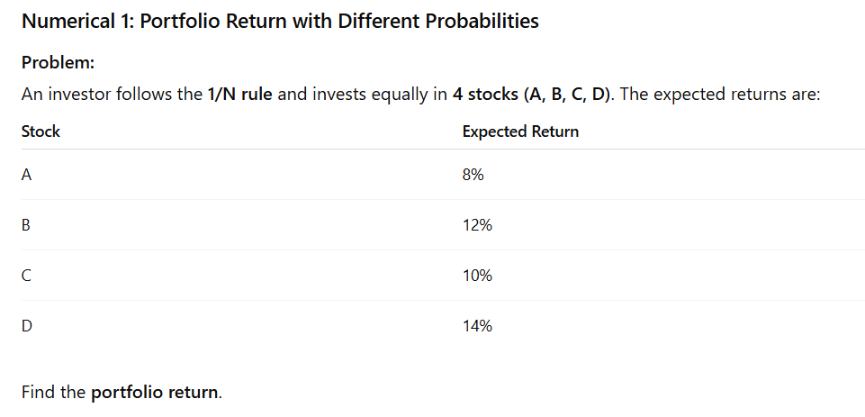
> OCR cue: Numerical 1: Portfolio Return with Different Probabilities Problem: An investor follows the 1/N rule and invests equally in 4 stocks (A, B, C, D). The expected returns are: Stock A Find the portfolio return. Expected Return 8% 12% 10% 14%

### Figure 5 (Slide 17)
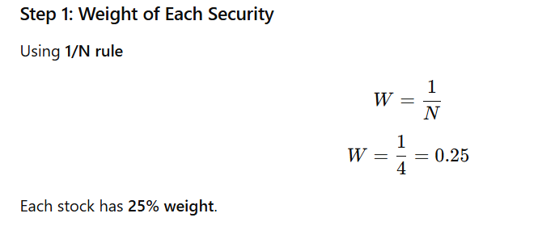
> OCR cue: Step 1: Weight of Each Security Using 1/N rule Each stock has 25% weight.

### Figure 6 (Slide 18)
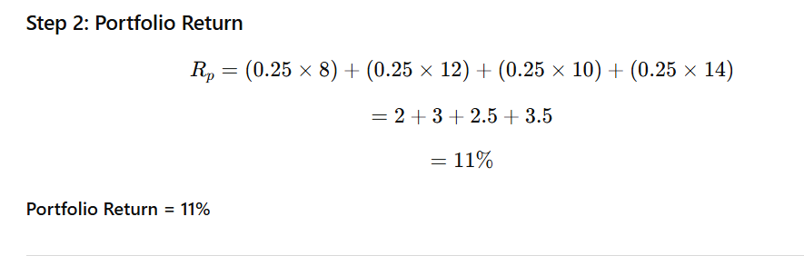
> OCR cue: Step 2: Portfolio Return R, = (0.25 x 8) + (0.25 x 12) + (0.25 x 10) + (0.25 x 14) =24+34+2.543.5 = 11% Portfolio Return = 11%

### Figure 7 (Slide 19)
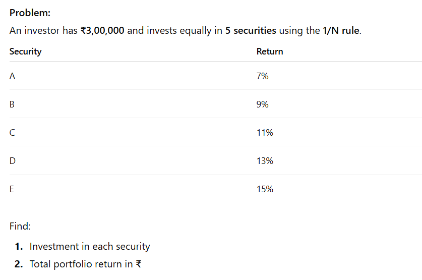
> OCR cue: Problem: An investor has 3,00,000 and invests equally in 5 securities using the 1/N rule. Security Return A 7% B 9% Cc 11% D 13% E 15% Find: 1. Investment in each security 2. Total portfolio return in =

### Figure 8 (Slide 20)
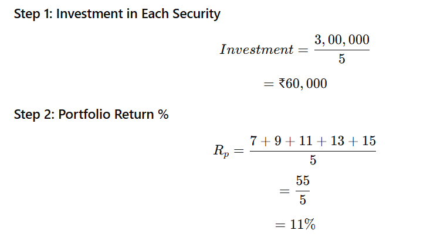
> OCR cue: Step 1: Investment in Each Security Investment = — = %60, 000 Step 2: Portfolio Return % p= ee 13 +15 _ 5 5 = 11%

### Figure 9 (Slide 21)
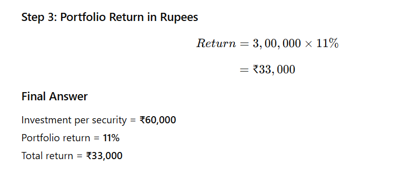
> OCR cue: Step 3: Portfolio Return in Rupees Return = 3,00, 000 x 11% = %33, 000 Final Answer Investment per security = 60,000 Portfolio return = 11% Total return = 33,000

## UNIT 4/10 Rolling Covariance Windows.pptx
### Figure 1 (Slide 3)
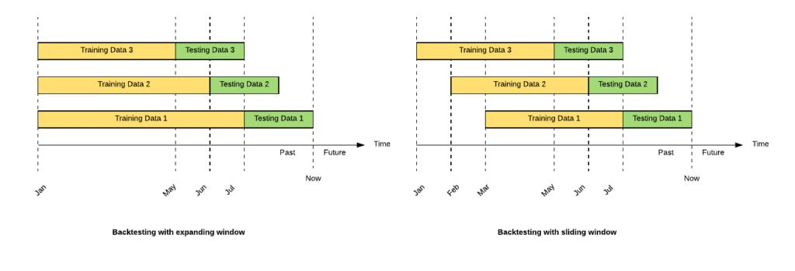
> OCR cue: Past Backtosting with sliding window Backtesting with expanding window

### Figure 2 (Slide 12)
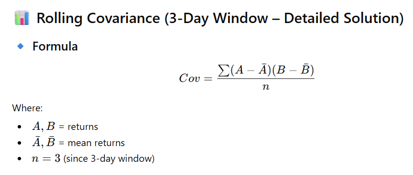
> OCR cue: ‘al Rolling Covariance (3-Day Window — Detailed Solution) ¢@ Formula _ S(4~4)(B-B) Cov Where: e A,B = returns . A, B = mean returns * n= 3 (since 3-day window)

### Figure 3 (Slide 13)
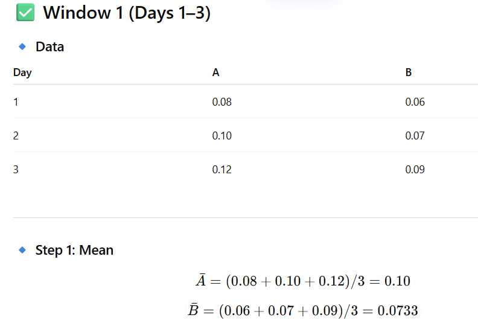
> OCR cue: Window 1 (Days 1-3) ¢ Data Day 1 ¢ Step 1: Mean 0.08 0.10 0.12 0.06 0.07 0.09 A = (0.08 + 0.10 + 0.12)/3 = 0.10 B = (0.06 + 0.07 + 0.09)/3 = 0.0733

### Figure 4 (Slide 14)
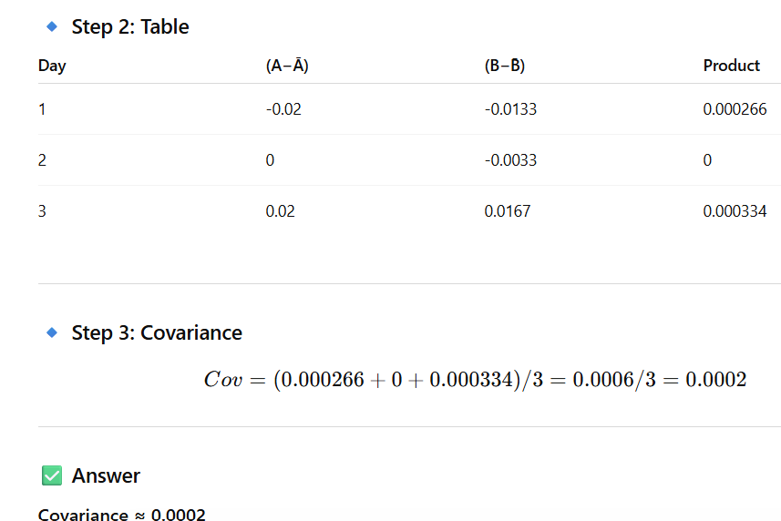
> OCR cue: ¢ Step 2: Table Day (A-A) (B-B) 1 -0.02 -0.0133 2 0 -0.0033 3 0.02 0.0167 ¢@ Step 3: Covariance Product 0.000266 0.000334 Cov = (0.000266 + 0 + 0.000334)/3 = 0.0006/3 = 0.0002 Answer Covariance = 0.0002

### Figure 5 (Slide 15)
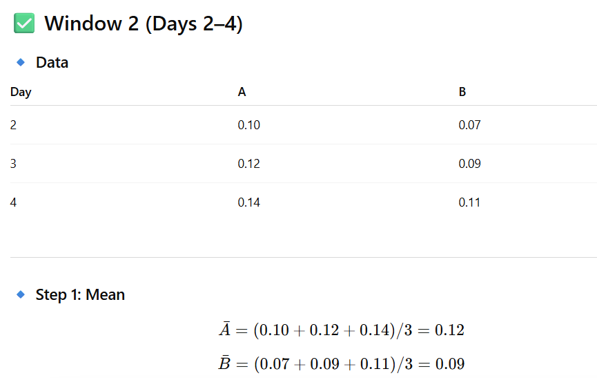
> OCR cue: Window 2 (Days 2-4) ¢ Data Day 2 3 4 ¢ Step 1: Mean 0.10 0.12 0.14 0.07 0.09 0.11 A= (0.10 + 0.12 + 0.14)/3 = 0.12 B = (0.07 + 0.09 + 0.11)/3 = 0.09

### Figure 6 (Slide 16)
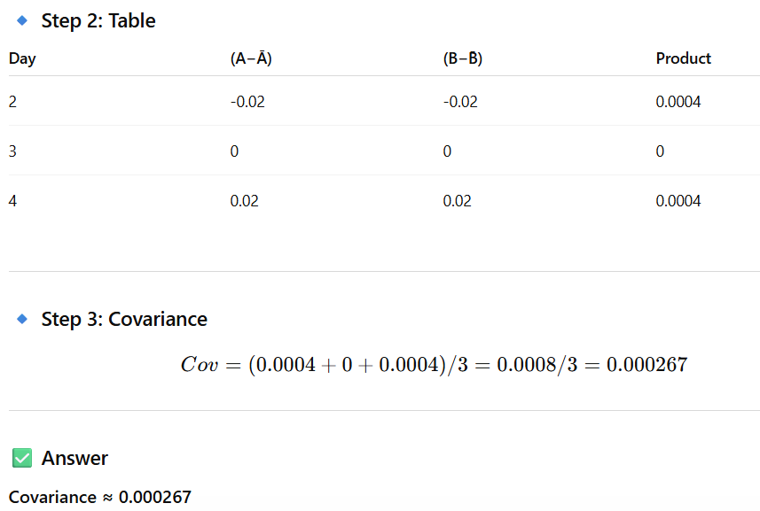
> OCR cue: ¢ Step 2: Table Day (a-A) (6-8) 2 -0.02 -0.02 3 0 0 4 0.02 0.02 ¢@ Step 3: Covariance Product 0.0004 0.0004 Cov = (0.0004 + 0 + 0.0004) /3 = 0.0008/3 = 0.000267 Answer Covariance = 0.000267

### Figure 7 (Slide 17)
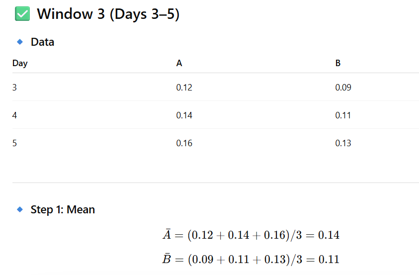
> OCR cue: Window 3 (Days 3-5) ¢ Data Day 3 ¢ Step 1: Mean 0.12 0.14 0.16 0.09 0.11 0.13 A= (0.12 + 0.14 + 0.16)/3 = 0.14 B = (0.09 + 0.11 + 0.13)/3 = 0.11

### Figure 8 (Slide 18)
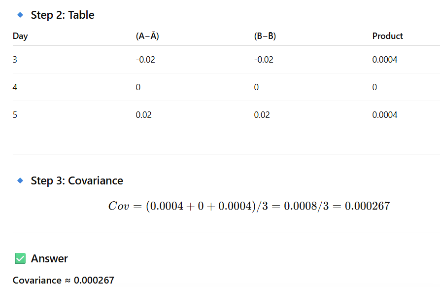
> OCR cue: ¢ Step 2: Table Day 3 ¢@ Step 3: Covariance (A-A) -0.02 0.02 (B-B) -0.02 0.02 Product 0.0004 0.0004 Cov = (0.0004 + 0 + 0.0004) /3 = 0.0008/3 = 0.000267 Answer Covariance * 0.000267

### Figure 9 (Slide 19)
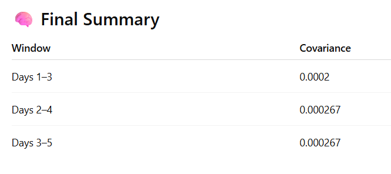
> OCR cue: © Final Summary Window Days 1-3 Days 2-4 Days 3-5 Covariance 0.0002 0.000267 0.000267

### Figure 10 (Slide 22)
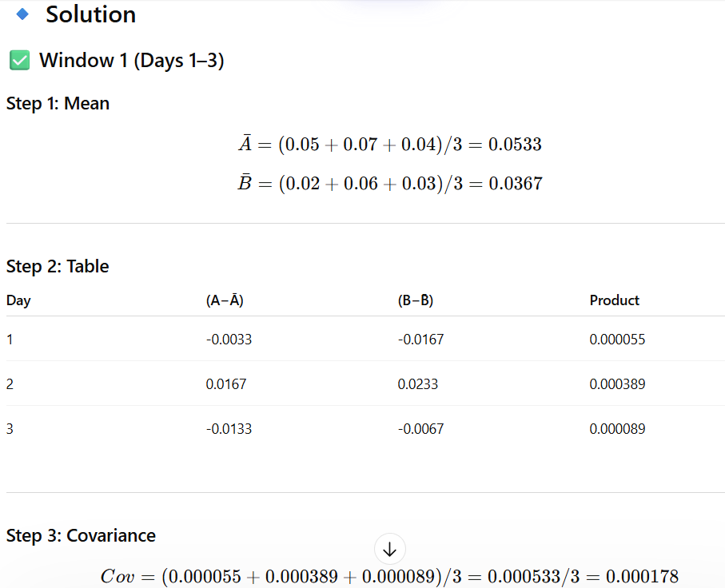
> OCR cue: ¢@ Solution Window 1 (Days 1-3) Step 1: Mean A = (0.05 + 0.07 + 0.04)/3 = 0.0533 B = (0.02 + 0.06 + 0.03)/3 = 0.0367 Step 2: Table Day (A-A) (B-B) Product 1 -0.0033 -0.0167 0.000055 2 0.0167 0.0233 0.000389 3 -0.0133 -0.0067 0.000089 Step 3: Covariance Vv Cov = (0.000055 + 0.000389 + 0.000089) /3 = 0.000533/3 = 0.000178

### Figure 11 (Slide 23)
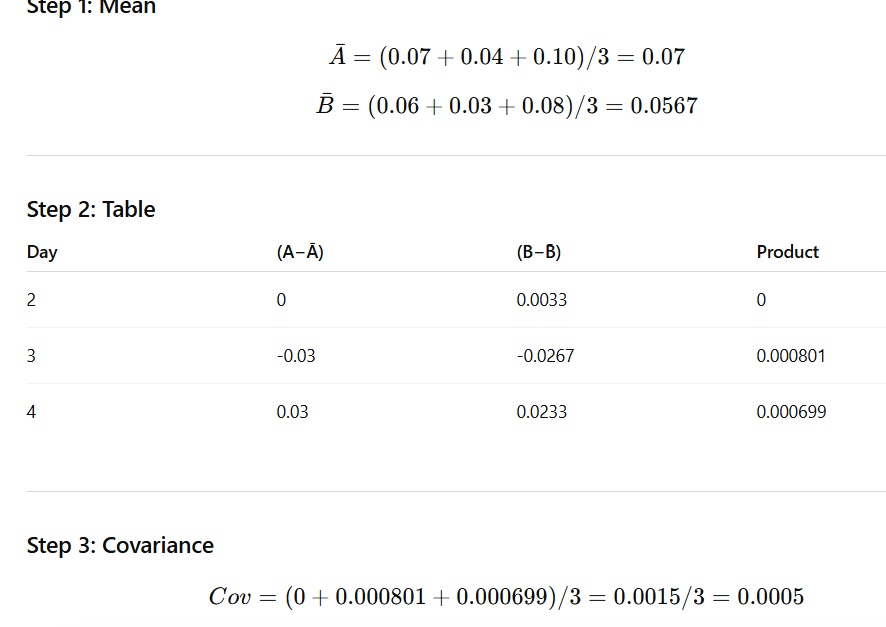
> OCR cue: step I. viean A = (0.07 + 0.04 + 0.10)/3 = 0.07 B = (0.06 + 0.03 + 0.08)/3 = 0.0567 Step 2: Table Day (a-A) (B-B) Product 2 0 0.0033 0 3 -0.03 -0.0267 0.000801 4 0.03 0.0233 0.000699 Step 3: Covariance Cov = (0 + 0.000801 + 0.000699) /3 = 0.0015/3 = 0.0005

### Figure 12 (Slide 24)
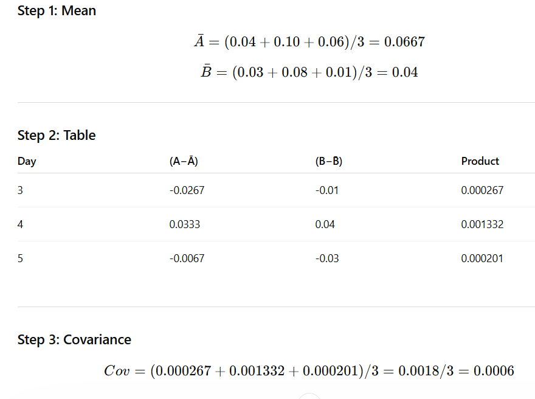
> OCR cue: Step 1: Mean A= (0.04 + 0.10 + 0.06)/3 = 0.0667 B = (0.03 + 0.08 + 0.01)/3 = 0.04 Step 2: Table Day (A-A) (B-B) Product 3 -0.0267 -0.01 0.000267 4 0.0333 0.04 0.001332 5 -0.0067 -0.03 0.000201 Step 3: Covariance Cov = (0.000267 + 0.001332 + 0.000201) /3 = 0.0018/3 = 0.0006

### Figure 13 (Slide 25)
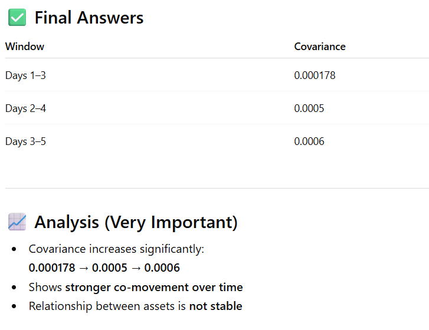
> OCR cue: Final Answers Window Covariance Days 1-3 0.000178 Days 2-4 0.0005 Days 3-5 0.0006 -~ Analysis (Very Important) © Covariance increases significantly: 0.000178 — 0.0005 — 0.0006 * Shows stronger co-movement over time * Relationship between assets is not stable

### Figure 14 (Slide 26)
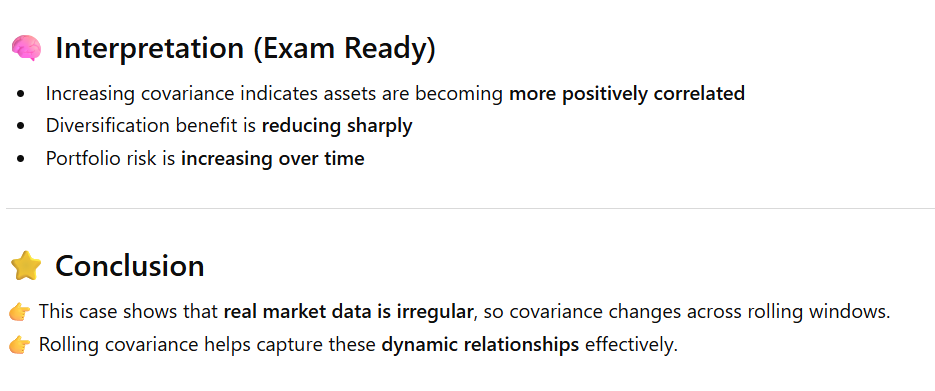
> OCR cue: © Interpretation (Exam Ready) ¢ Increasing covariance indicates assets are becoming more positively correlated © Diversification benefit is reducing sharply © Portfolio risk is increasing over time wW Conclusion © This case shows that real market data is irregular, so covariance changes across rolling windows. © Rolling covariance helps capture these dynamic relationships effectively.

## UNIT 4/11 Comparing optimization & diversification approaches_ Empirical comparison.pptx
### Figure 1 (Slide 7)
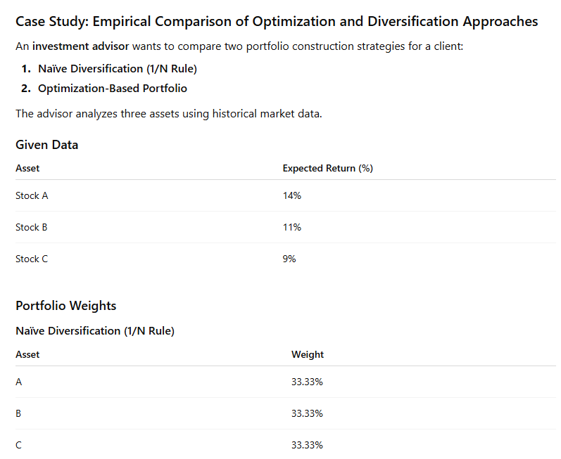
> OCR cue: Case Study: Empirical Comparison of Optimization and Diversification Approaches An investment advisor wants to compare two portfolio construction strategies for a client: 1. Naive Diversification (1/N Rule) 2. Optimization-Based Portfolio The advisor analyzes three assets using historical market data. Given Data Asset Expected Return (%) Stock A 14% Stock B 11% Stock C 9% Portfolio Weights Naive D

### Figure 2 (Slide 8)
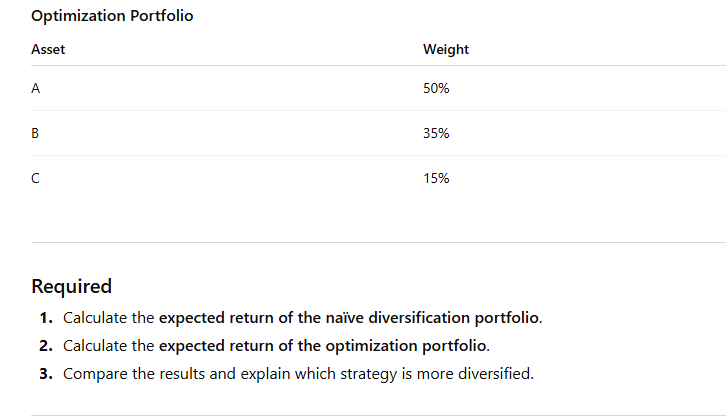
> OCR cue: Optimization Portfolio Asset Weight A 50% B 35% c 15% Required 1. Calculate the expected return of the naive diversification portfolio. 2. Calculate the expected return of the optimization portf 3. Compare the results and explain which strategy is more diversified.

### Figure 3 (Slide 9)
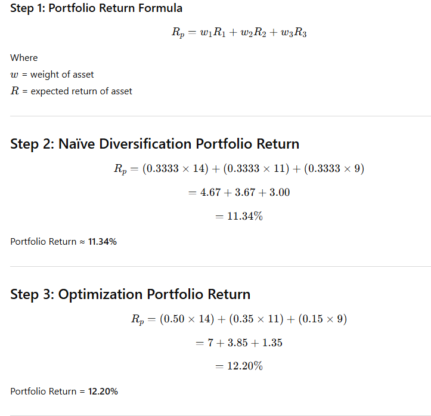
> OCR cue: Step 1: Portfolio Return Formula Ry = wR, + weRe + w3Ry Where w = weight of asset R = expected return of asset Step 2: Naive Diversification Portfolio Return R, = (0.3333 x 14) + (0.3333 x 11) + (0.3333 x 9) = 4.67 + 3.67 + 3.00 = 11.34% Portfolio Return = 11.34% Step 3: Optimization Portfolio Return Ry, = (0.50 x 14) + (0.35 x 11) + (0.15 x 9) = 743.85 +135 = 12.20% Portfolio Return = 12.20%

### Figure 4 (Slide 10)
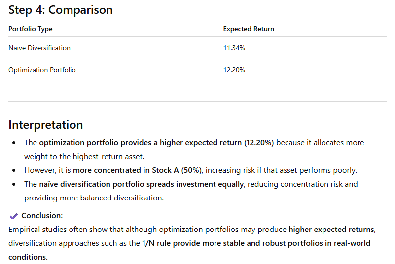
> OCR cue: Step 4: Comparison Portfolio Type Expected Return Naive Diversification 11.34% Optimization Portfolio 12.20% Interpretation * The optimization portfolio provides a higher expected return (12.20%) because it allocates more weight to the highest-return asset. * However, it is more concentrated in Stock A (50%), increasing risk if that asset performs poorly. * The naive diversification portfolio spre

## UNIT 4/4 What is a Risk Budget.docx
### Figure 1 (Image)
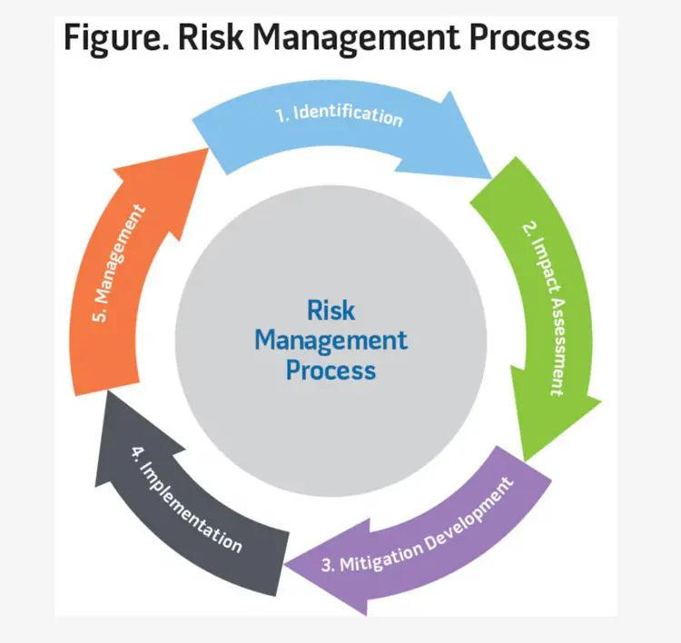
> OCR cue: Figure. Risk Management Process st \dentificatio, 2 wr quaussassv ped

## UNIT 4/5 Risk Budgeting Numericals.pptx
### Figure 1 (Slide 2)
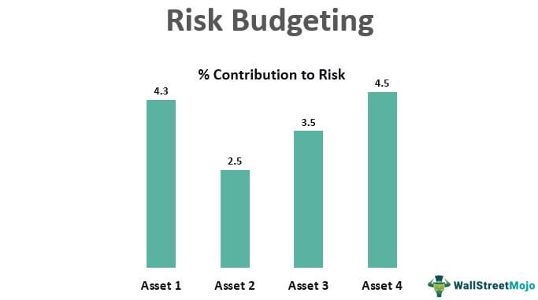
> OCR cue: Risk Budgeting % Contribution to Risk =, 43 35 | Asset1 — Asset2-«Asset3. «Asset 4 “E> WallstreetMojo

## UNIT 4/6 Simplified Risk Parity Portfolios.pptx
### Figure 1 (Slide 7)
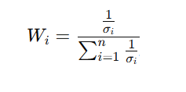

### Figure 2 (Slide 11)
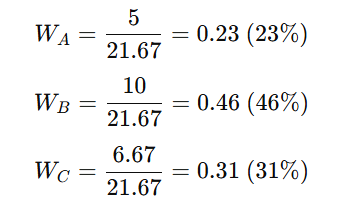
> OCR cue: Wa 5 = —"— = 0.23 (23% Wa ser (23%) 10 = = 0.46 (46% a67 9 (46%) 6.67 = ——* =0.31 (31% ©~ 31.67 (31%)

### Figure 3 (Slide 13)
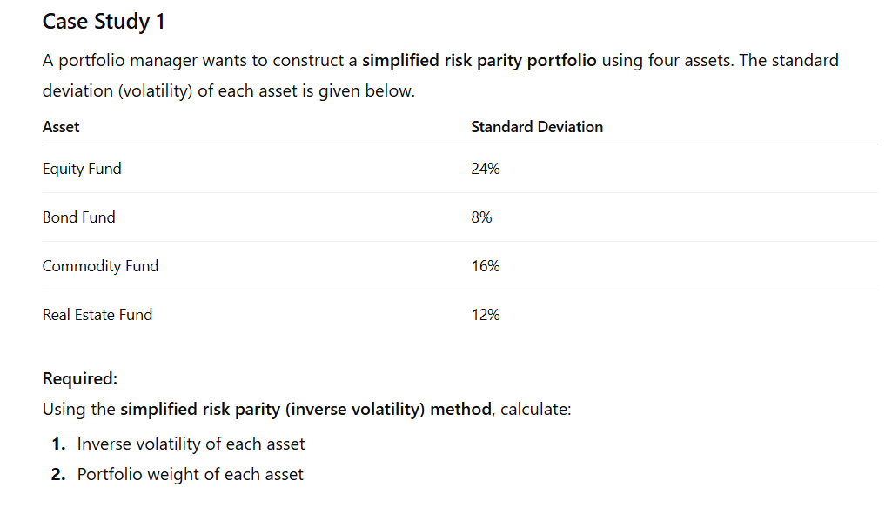
> OCR cue: Case Study 1 A portfolio manager wants to construct a simplified risk parity portfolio using four assets. The standard deviation (volatility) of each asset is given below. Asset Standard Deviation Equity Fund 24% Bond Fund 8% Commodity Fund 16% Real Estate Fund 12% Required: Using the simplified risk parity (inverse volatility) method, calculate: 1. Inverse volatility of each asset 2. Portfolio we

### Figure 4 (Slide 14)
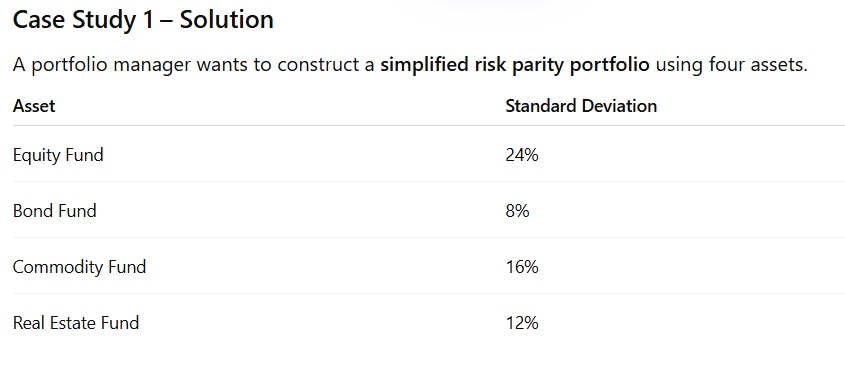
> OCR cue: Case Study 1 - Solution A portfolio manager wants to construct a simplified risk parity portfolio using four assets. Asset Standard Deviation Equity Fund 24% Bond Fund 8% Commodity Fund 16% Real Estate Fund 12%

### Figure 5 (Slide 15)
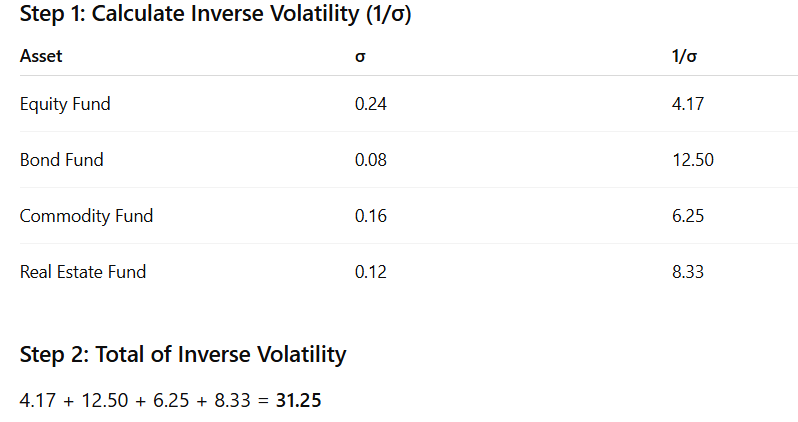
> OCR cue: Step 1: Calculate Inverse Volatility (1/0) Asset ° Vo Equity Fund 0.24 4q7 Bond Fund 0.08 12.50 Commodity Fund 0.16 6.25 Real Estate Fund 0.12 833 Step 2: Total of Inverse Volatility 4.17 + 12.50 + 6.25 + 8.33 = 31.25

### Figure 6 (Slide 16)
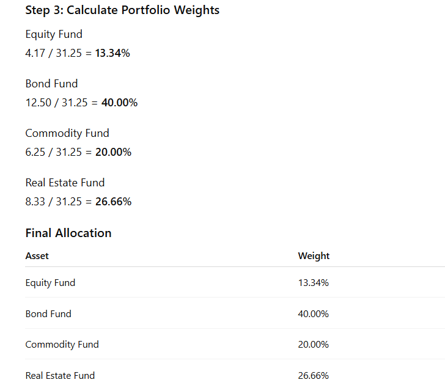
> OCR cue: Step 3: Calculate Portfolio Weights Equity Fund 4.7 / 31.25 = 13.34% Bond Fund 12.50 / 31.25 = 40.00% Commodity Fund 6.25 / 31.25 = 20.00% Real Estate Fund 8.33 / 31.25 = 26.66% Final Allocation Asset Equity Fund Bond Fund Commodity Fund Real Estate Fund Weight 13.34% 20.00% 26.66%

### Figure 7 (Slide 17)
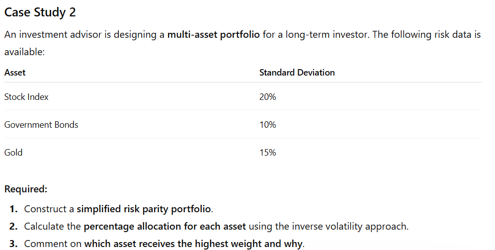
> OCR cue: Case Study 2 An investment advisor is designing a multi-asset portfolio for a long-term investor. The following risk data is available: Asset Standard Deviation Stock Index 20% Government Bonds 10% Gold 15% Required: 1. Construct a simplified risk parity portfolio. 2. Calculate the percentage allocation for each asset using the inverse volatility approach. 3. Comment on which asset receives the hi

### Figure 8 (Slide 18)
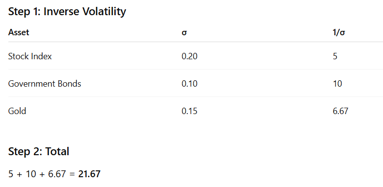
> OCR cue: Step 1: Inverse Volatility Asset Stock Index Government Bonds Gold Step 2: Total 5 + 10 + 6.67 = 21.67 0.20 0.10 0.15 Vo 6.67

### Figure 9 (Slide 19)
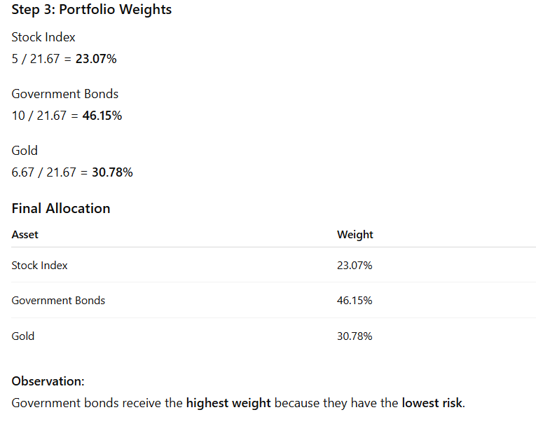
> OCR cue: Step 3: Portfolio Weights Stock Index 5 / 21.67 = 23.07% Government Bonds 10 / 21.67 = 46.15% Gold 6.67 / 21.67 = 30.78% Final Allocation Asset Weight Stock Index 23.07% Government Bonds 46.15% Gold 30.78% Observation: Government bonds receive the highest weight because they have the lowest risk.

### Figure 10 (Slide 20)
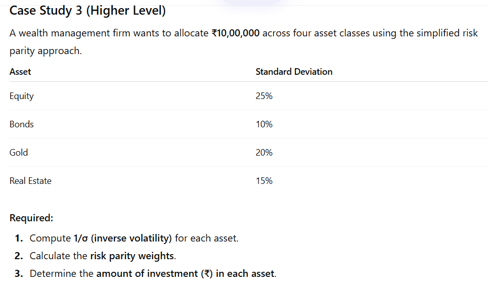
> OCR cue: Case Study 3 (Higher Level) A wealth management firm wants to allocate %10,00,000 across four asset classes using the simplified risk parity approach. Asset Standard Deviation Equity 25% Bonds 10% Gold 20% Real Estate 15% Required: 1. Compute 1/c (inverse volatility) for each asset. 2. Calculate the risk parity weights. 3. Determine the amount of investment (%) in each asset.

### Figure 11 (Slide 21)
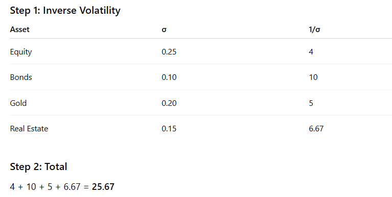
> OCR cue: Step 1: Inverse Volatility Asset Equity Bonds Gold Real Estate Step 2: Total 4+10+5 + 6.67 = 25.67 0.25 0.10 0.20 0.15 6.67

### Figure 12 (Slide 22)
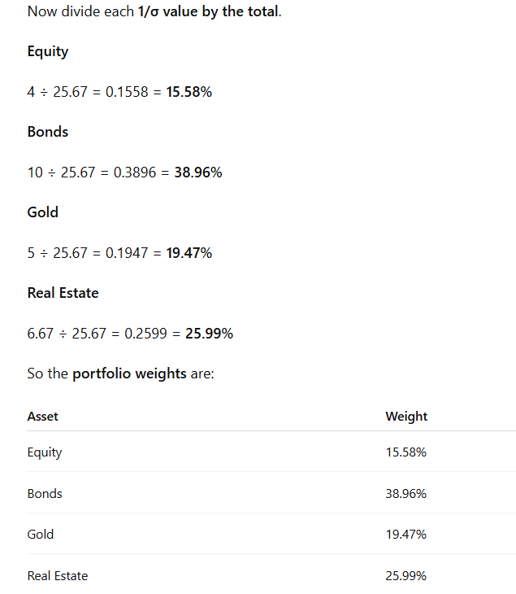
> OCR cue: Now divide each 1/o value by the total. Equity 4 = 25.67 = 0.1558 = 15.58% Bonds 10 + 25.67 = 0.3896 = 38.96% Gold 5 + 25.67 = 0.1947 = 19.47% Real Estate 6.67 = 25.67 = 0.2599 = 25.99% So the portfolio weights are: Asset Equity Bonds Gold Real Estate Weight 15.58% 38.96% 19.47% 25.99%

### Figure 13 (Slide 23)
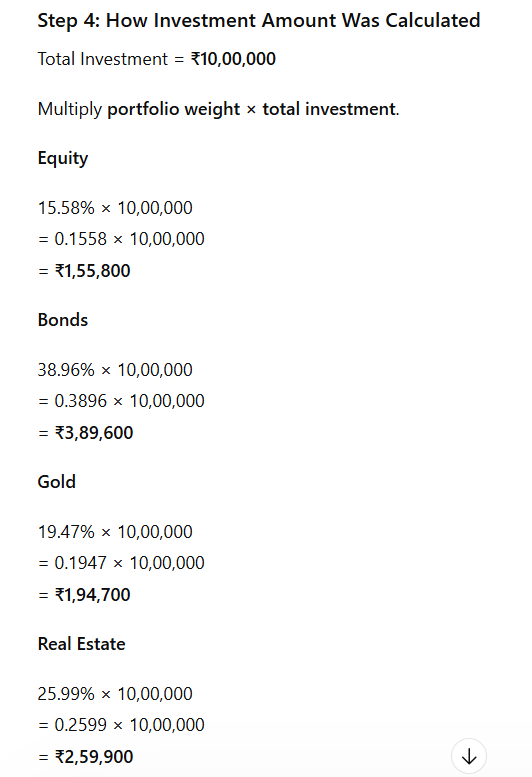
> OCR cue: Step 4: How Investment Amount Was Calculated Total Investment = 210,00,000 Multiply portfolio weight x total investment. Equity 15.58% x 10,00,000 = 0.1558 x 10,00,000 = %1,55,800 Bonds 38.96% x 10,00,000 = 0.3896 x 10,00,000 = %3,89,600 Gold 19.47% x 10,00,000 = 0.1947 x 10,00,000 = %1,94,700 Real Estate 25.99% x 10,00,000 = 0.2599 x 10,00,000 = %2,59,900 Vv

### Figure 14 (Slide 24)
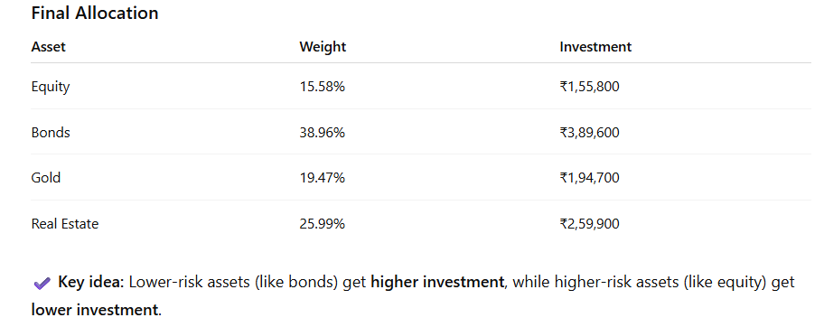
> OCR cue: Final Allocation Asset Weight Investment Equity 15.58% 31,55,800 Bonds 38.96% 3,89,600 Gold 19.47% 31,94,700 Real Estate 25.99% %2,59,900 Vv Key idea: Lower-risk assets (like bonds) get higher investment, while higher-risk assets (like equity) get lower investment.

### Figure 15 (Slide 25)
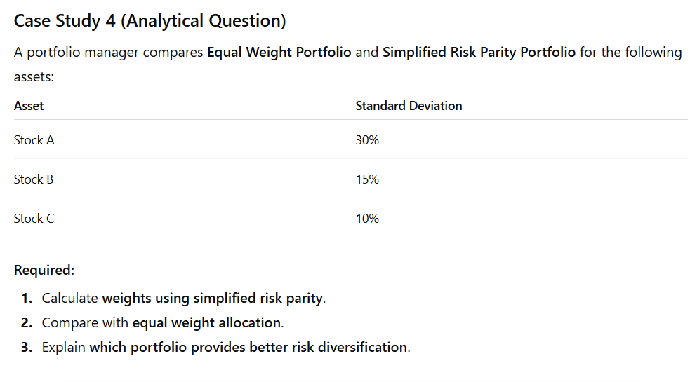
> OCR cue: Case Study 4 (Analytical Question) A portfolio manager compares Equal Weight Portfolio and Simplified Risk Parity Portfolio for the following assets: Asset Standard Deviation Stock A 30% Stock B 15% Stock C 10% Required: 1. Calculate weights using simplified risk parity. 2. Compare with equal weight allocation. 3. Explain which portfolio provides better risk diversification.

### Figure 16 (Slide 26)
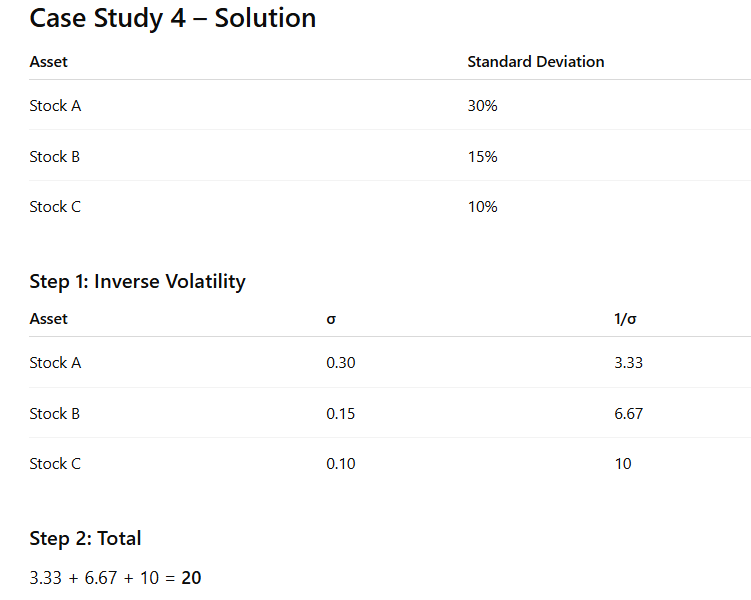
> OCR cue: Case Study 4 — Solution Asset Stock A Stock B Stock C Step 1: Inverse Volatility Asset ° Stock A 0.30 Stock B 0.15 Stock C 0.10 Step 2: Total 3.33 + 6.67 + 10 = 20 Standard Deviation 30% 15% 10% 3.33 6.67

### Figure 17 (Slide 27)
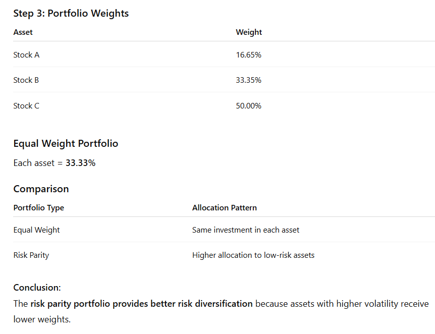
> OCR cue: Step 3: Portfolio Weights Asset Weight Stock A 16.65% Stock B 33.35% Stock C 50.00% Equal Weight Portfolio Each asset = 33.33% Comparison Portfolio Type Allocation Pattern Equal Weight ‘Same investment in each asset Risk Parity Higher allocation to low-risk assets Conclusion: The risk parity portfolio provides better risk diversification because assets with higher volatility receive lower weights.

## UNIT 4/7 Full Risk Parity Portfolios.pptx
### Figure 1 (Slide 9)
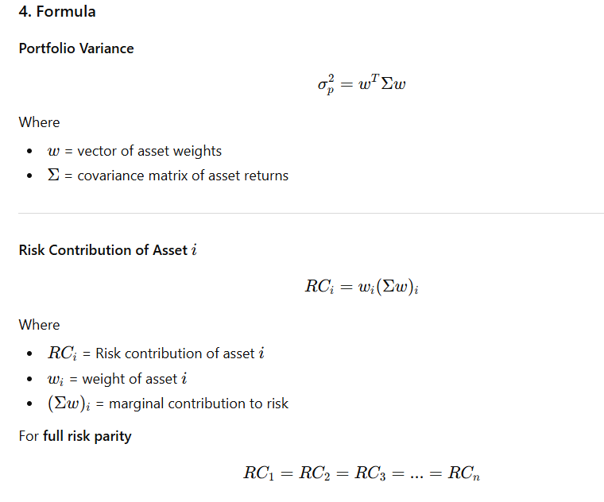
> OCR cue: 4, Formula Portfolio Variance o =w' dw Where * w= vector of asset weights « = covariance matrix of asset returns Risk Contribution of Asset 7 RC; = w;(Zw); Where * RC; = Risk contribution of asset i * w; = weight of asset i « (Zw); = marginal contribution to risk For full risk parity RC, = RCz = RC3 =... = RC,

### Figure 2 (Slide 10)
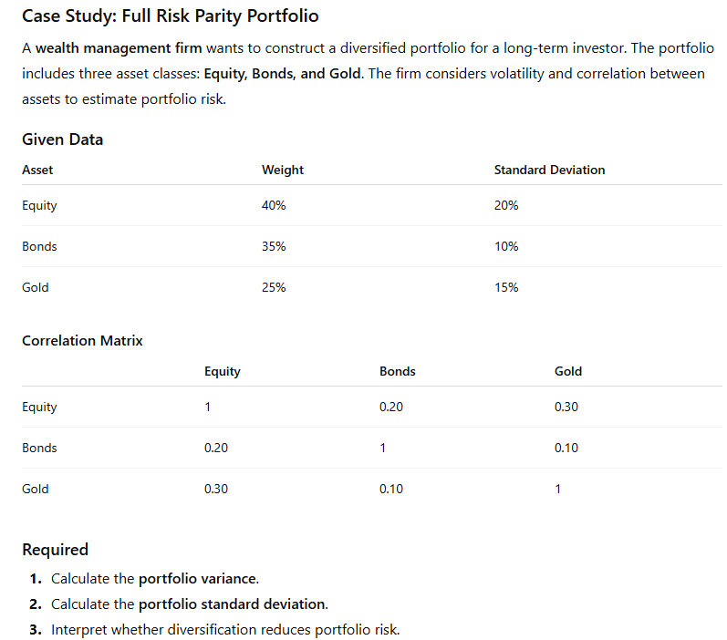
> OCR cue: Case Study: Full Risk Parity Portfolio A.wealth management firm wants to construct a diversified portfolio for a long-term investor. The portfolio includes three asset classes: Equity, Bonds, and Gold. The firm considers volatility and correlation between assets to estimate portfolio risk. en Data Asset Equity Bonds Gold Correlation Matrix Equity Equity 1 Bonds 0.20 Gold 030 Required 1. Calculate 

### Figure 3 (Slide 11)
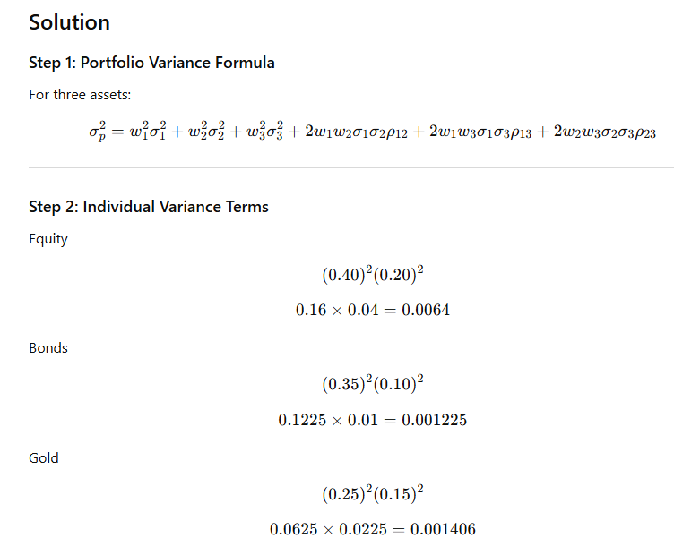
> OCR cue: Solution Step 1: Portfolio Variance Formula For three assets: 252. wo2 + w? oO, = wyoj + w303 + w30% + Qwiweoid2p12 + 2wiwso103pi3 + 2w2w30203p23 Step 2: Individual Variance Terms Equity (0.40)?(0.20) 0.16 x 0.04 = 0.0064 Bonds (0.35)?(0.10) 0.1225 x 0.01 = 0.001225 Gold (0.25)°(0.15)? 0.0625 x 0.0225 = 0.001406

### Figure 4 (Slide 12)
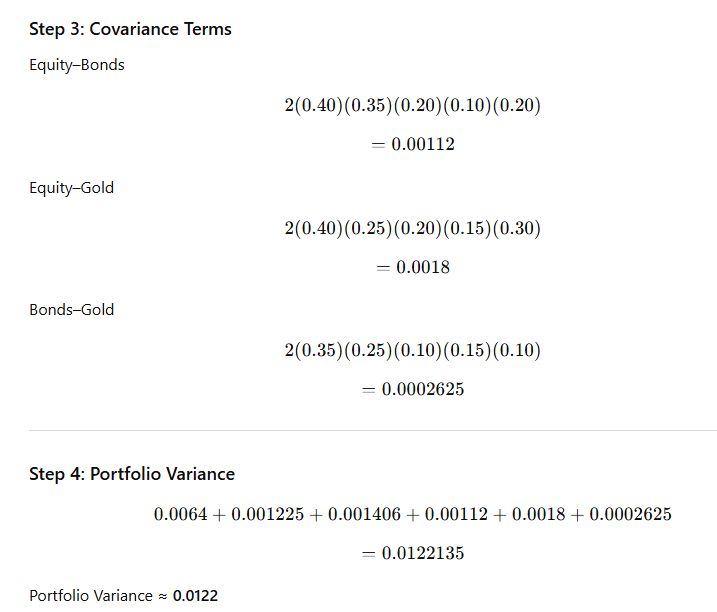
> OCR cue: Step 3: Covariance Terms Equity-Bonds 2(0.40)(0.35) (0.20)(0.10) (0.20) = 0.00112 Equity-Gold 2(0.40)(0.25) (0.20)(0.15) (0.30) = 0.0018 Bonds-Gold 2(0.35)(0.25)(0.10)(0.15)(0.10) = 0.0002625 Step 4: Portfolio Variance 0.0064 + 0.001225 + 0.001406 + 0.00112 + 0.0018 + 0.0002625 = 0.0122135 Portfolio Variance = 0.0122

### Figure 5 (Slide 13)
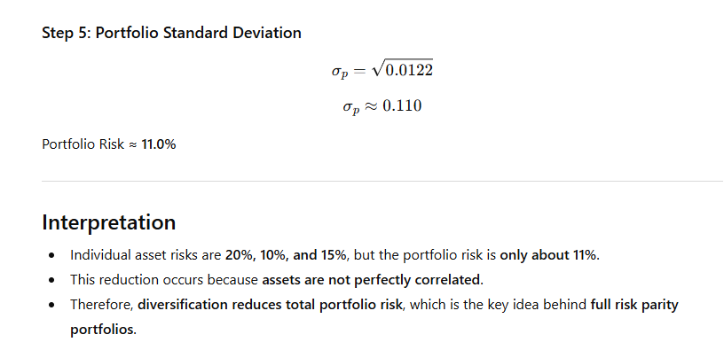
> OCR cue: Step 5: Portfolio Standard Deviation op = V0.0122 op © 0.110 Portfolio Risk = 11.0% Interpretation Individual asset risks are 20%, 10%, and 15%, but the portfolio risk is only about 11%. © This reduction occurs because assets are not perfectly correlated. Therefore, diversification reduces total portfolio risk, which is the key idea behind full risk parity portfolios.

### Figure 6 (Slide 14)
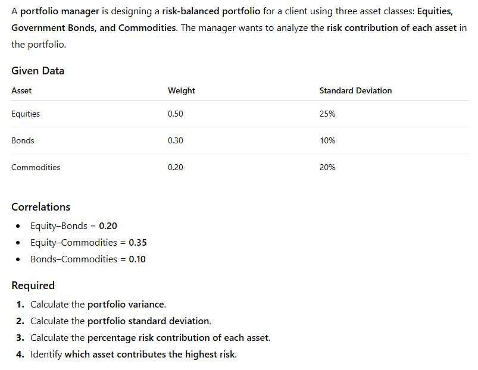
> OCR cue: A portfolio manager is designing a risk-balanced portfolio for a client using three asset classes: Equities, Government Bonds, and Commodities. The manager wants to analyze the risk contribution of each asset in the portfolio. Given Data Asset Weight Standard Deviation Equities 0.50 25% Bonds 0.30 10% Commodities 0.20 20% Correlations © Equity-Bonds = 0.20 © Equity-Commodities = 0.35 © Bonds-Commo

### Figure 7 (Slide 15)
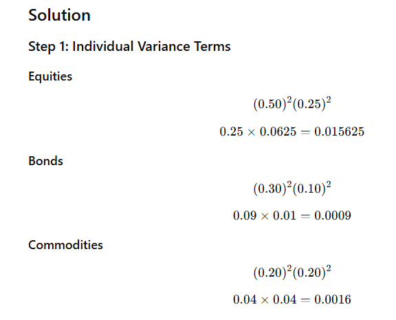
> OCR cue: Solution Step 1: Individual Variance Terms Equities (0.50)?(0.25) 0.25 x 0.0625 — 0.015625 Bonds (0.30)?(0.10) 0.09 x 0.01 = 0.0009 Commodities (0.20)?(0.20) 0.04 x 0.04 = 0.0016

### Figure 8 (Slide 16)
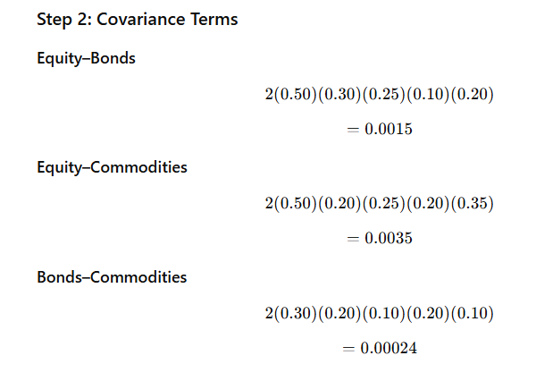
> OCR cue: Step 2: Covariance Terms Equity-Bonds 2(0.50) (0.30)(0.25)(0.10)(0.20) = 0.0015 Equity-Commodities 2(0.50) (0.20) (0.25) (0.20)(0.35) = 0.0035 Bonds-Commodities 2(0.30)(0.20)(0.10)(0.20)(0.10) = 0.00024

### Figure 9 (Slide 17)
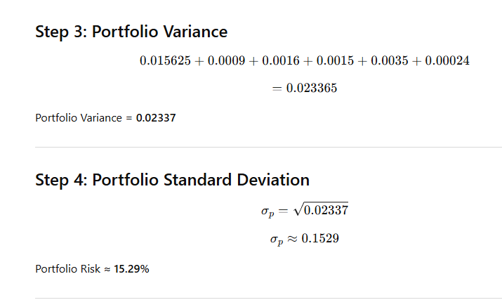
> OCR cue: Step 3: Portfolio Variance 0.015625 + 0.0009 + 0.0016 + 0.0015 + 0.0035 + 0.00024 = 0.023365 Portfolio Variance = 0.02337 Step 4: Portfolio Standard Deviation oy = V0.02337 op © 0.1529 Portfolio Risk = 15.29%

### Figure 10 (Slide 18)
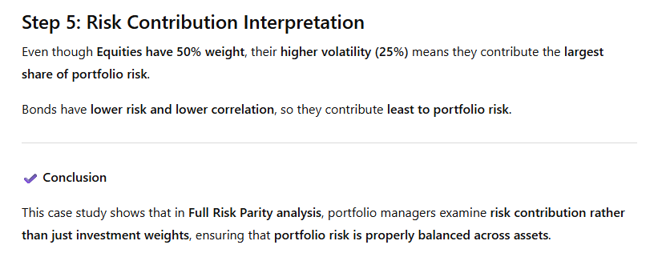
> OCR cue: Step 5: Risk Contribution Interpretation Even though Equities have 50% weight, their higher volatility (25%) means they contribute the largest share of portfolio risk. Bonds have lower risk and lower correlation, so they contribute least to portfolio risk. ¥ Conclusion This case study shows that in Full Risk Parity analysis, portfolio managers examine risk contribution rather than just investment 

## UNIT 4/8 Shrinkage Estimators.pptx
### Figure 1 (Slide 12)
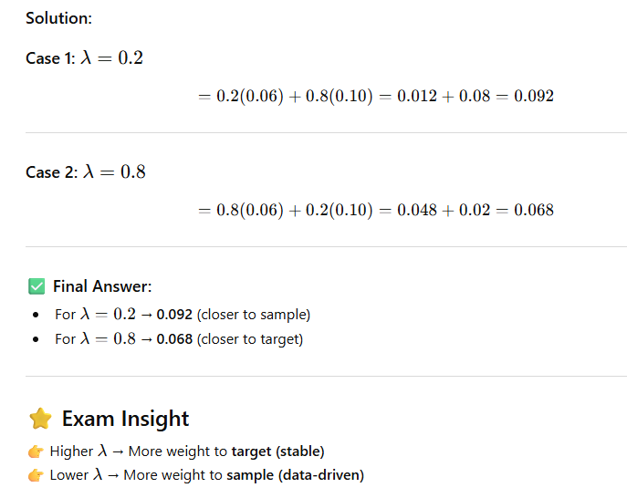
> OCR cue: Solution: Case 1: A = 0.2 = 0.2(0.06) + 0.8(0.10) = 0.012 + 0.08 = 0.092 Case 2: A = 0.8 = 0.8(0.06) + 0.2(0.10) = 0.048 + 0.02 = 0.068 Final Answer: © For A = 0.2 = 0.092 (closer to sample) © For A = 0.8 — 0.068 (closer to target) ww Exam Insight © Higher \ + More weight to target (stable) & Lower \ + More weight to sample (data-driven)

### Figure 2 (Slide 14)
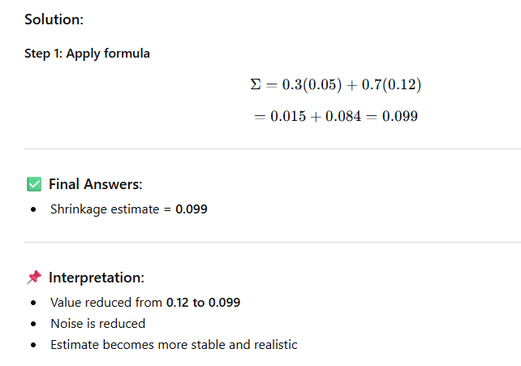
> OCR cue: Solution: Step 1: Apply formula B = 0.3(0.05) + 0.7(0.12) = 0.015 + 0.084 = 0.099 Final Answers: * Shrinkage estimate = 0.099 % Interpretatio © Value reduced from 0.12 to 0.099 * Noise is reduced * Estimate becomes more stable and realistic

### Figure 3 (Slide 15)
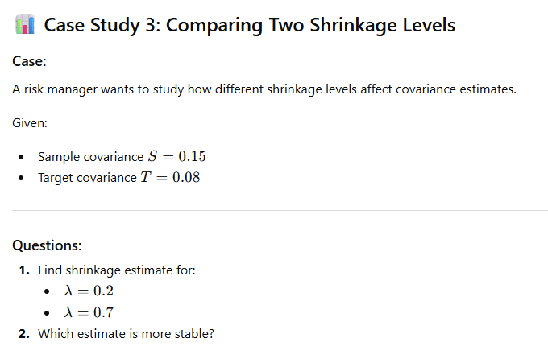
> OCR cue: il Case Study 3: Comparing Two Shrinkage Levels Case: A risk manager wants to study how different shrinkage levels affect covariance estimates. Given: © Sample covariance $ = 0.15 © Target covariance T = 0.08 Questions: 1. Find shrinkage estimate for: ° A=0.2 ° A=0.7 2. Which estimate is more stable?

### Figure 4 (Slide 16)
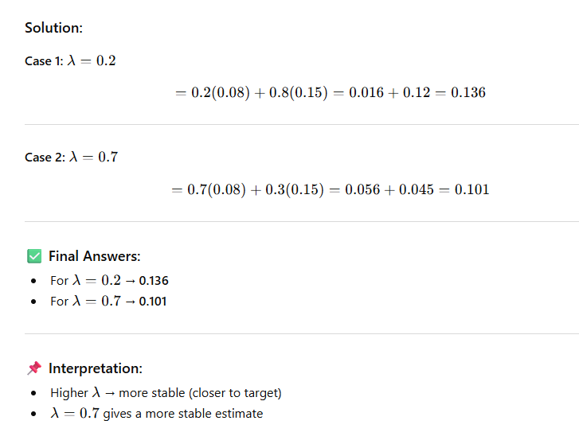
> OCR cue: Solution: Case 1: \ = 0.2 = 0.2(0.08) + 0.8(0.15) = 0.016 + 0.12 = 0.136 Case 2: = 0.7 = 0.7(0.08) + 0.3(0.15) = 0.056 + 0.045 = 0.101 Final Answers: © ForA = 0.2 + 0.136 ¢ ForA = 0.7 + 0.101 % Interpretation: * Higher A — more stable (closer to target) * 2 =0.7 gives a more stable estimate

## UNIT 4/9 EWMA (Exponentially Weighted Moving Average).pptx
### Figure 1 (Slide 3)
_s3_1.png)
> OCR cue: of = op +(1— Area © of; = current variance © O;_, = previous variance © Tt—1 = previous return e = decay factor (0 to 1, usually ~0.94)

### Figure 2 (Slide 5)
_s5_2.png)
> OCR cue: volatility EWMA volatilities for different lambdas 2019 2020 2021 2022 2023 — 7099 — 1-091 — 1-099

### Figure 3 (Slide 6)
_s6_3.png)
> OCR cue: Asset allocation 1990’s Asset allocation today Hl Stocks (equities) U.S. investment-grade bonds i Cash For ilustrative purposes only I Large-company stocks I Small-company stocks i international stocks 1 Emerging markets stocks i Corporate bonds Wi High-yield bonds Il Government bonds I Commodities Wrens its I cash

### Figure 4 (Slide 13)
_s13_4.png)
> OCR cue: ¢@ Formula of = dopey + (L—A)rz4 * Solution Step 1: Square the return r?_, = (0.10)? = 0.01 Step 2: Apply formula oa; = (0.94 x 0.04) + (0.06 x 0.01) Step 3: Calculate = 0.0376 + 0.0006 = 0.0382 Final Answer © Current variance = 0.0382

### Figure 5 (Slide 15)
_s15_5.png)
> OCR cue: * Solution (a) A = 0.94 = 0.94(0.04) + 0.06(0.01) = 0.0382 (b) A = 0.80 = 0.80(0.04) + 0.20(0.01) = 0.034 Answer © For 0.94 — 0.0382 © For 0.80 — 0.034

### Figure 6 (Slide 17)
_s17_6.png)
> OCR cue: * Solution Step 1: a} = 0.90(0.05) + 0.10(0.0064) = 0.04564 Step 2: o3 = 0.90(0.04564) + 0.10(0.0144) = 0.042516 Answer Variance at time 2 = 0.0425

### Figure 7 (Slide 19)
_s19_7.png)
> OCR cue: * Solution ra X rz = 0.10 x 0.08 = 0.008 Cov = 0.95(0.02) + 0.05(0.008) = 0.019 + 0.0004 = 0.0194 Answer Covariance = 0.0194

### Figure 8 (Slide 22)
_s22_8.png)
> OCR cue: ¢ Solution Step 1: Update Variance of Asset A o, = 0.90(0.05) + 0.10(0.12”) = 0.045 + 0.10(0.0144) = 0.045 + 0.00144 = 0.04644 Step 2: Update Variance of Asset B o% = 0.90(0.04) + 0.10(0.107) = 0.036 + 0.10(0.01) = 0.036 + 0.001 = 0.037

### Figure 9 (Slide 23)
_s23_9.png)
> OCR cue: Step 3: Update Covariance Cov = 0.90(0.02) + 0.10(0.12 x 0.10) = 0.018 + 0.10(0.012) = 0.018 + 0.0012 = 0.0192 Step 4: Portfolio Variance oO, = we, + WRoR + 2WawgCov = (0.6)?(0.04644) + (0.4)?(0.037) + 2(0.6)(0.4) (0.0192) = 0.36(0.04644) + 0.16(0.037) + 0.48(0.0192) = 0.0167184 + 0.00592 + 0.009216 = 0.0318544 Final Answer Variance of Asset A = 0.04644 Variance of Asset B = 0.037 Covariance = 0.0

## UNIT 5/2 CPPI.pptx
### Figure 1 (Slide 1)

> OCR cue: Constant Proportion Portfolio Insurance h » Cushion (C) = CPPI- F » Risky Asset (E) = Multiplier (M) x C Protection Floor (F) CPPI = E + Riskless asset (B) >

### Figure 2 (Slide 3)
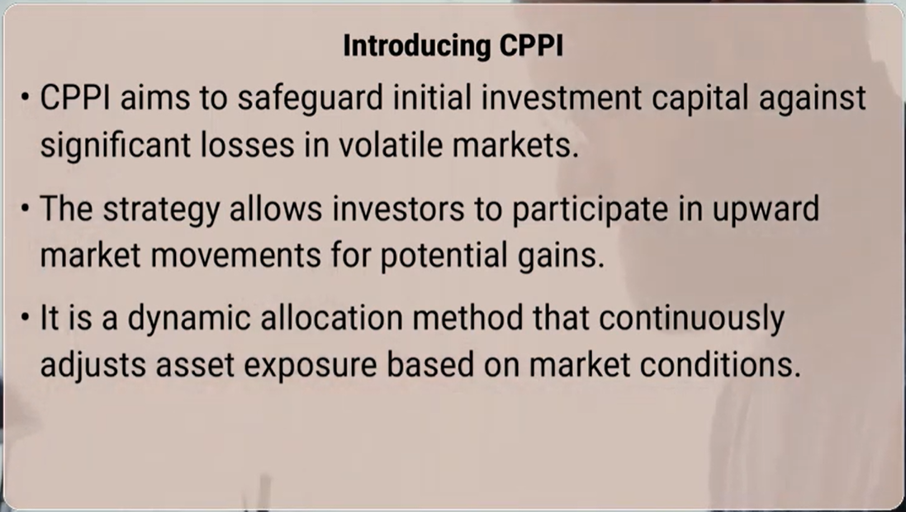
> OCR cue: Introducing CPPI * CPPI aims to safeguard initial investment capital against significant losses in volatile markets. * The strategy allows investors to participate in upward market movements for potential gains. * It is a dynamic allocation method that continuously adjusts asset exposure based on market conditions.

### Figure 3 (Slide 6)
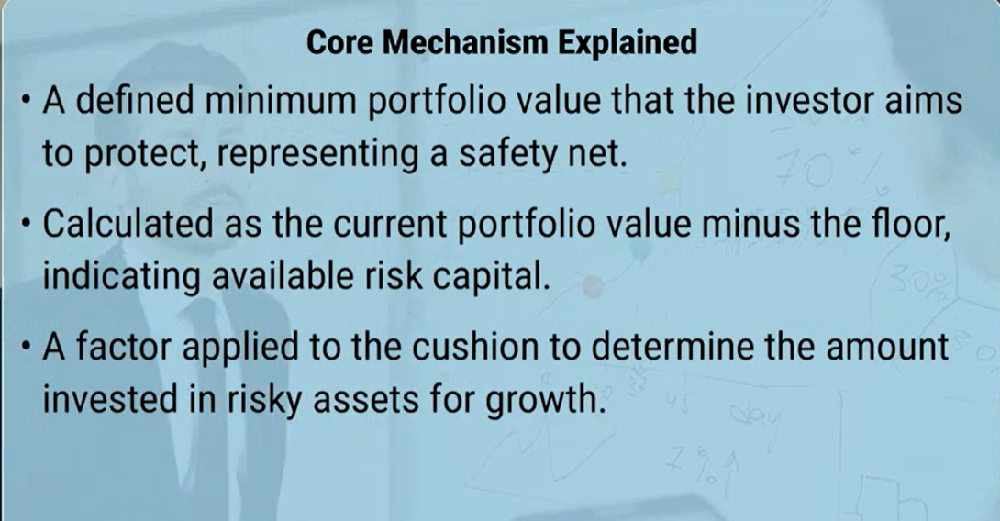
> OCR cue: Core Mechanism Explained * A defined minimum portfolio value that the investor aims to protect, representing a safety net. * Calculated as the current portfolio value minus the floor, indicating available risk capital. - A factor applied to the cushion to determine the amount invested in risky assets for growth.

### Figure 4 (Slide 7)
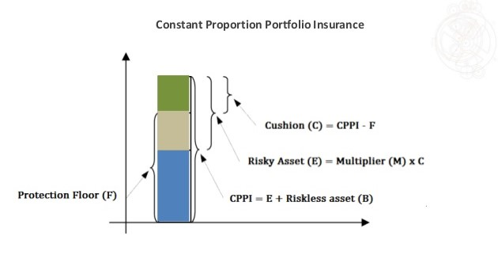
> OCR cue: Constant Proportion Portfolio Insurance h » Cushion (C) = CPPI- F » Risky Asset (E) = Multiplier (M) x C Protection Floor (F) CPPI = E + Riskless asset (B) >

## UNIT 5/_3 Analysis_ Simulating CPPI using GBM, Monte Carlo evaluation, Analyzing performance, drawdowns, floor violations, Designing and calibrating CPPI strategies (light, conceptual).pptx
### Figure 1 (Slide 7)
_s7_1.png)
> OCR cue: Case Study: Drawdown Analysis with Recovery An investor observes the following portfolio values: Period Portfolio Value (3) Day 1 8,00,000 Day 2 9,20,000 Day 3 8,70,000 Day 4 10,00,000 Day 5 8,00,000 Day 6 8,80,000

### Figure 2 (Slide 8)
_s8_2.png)
> OCR cue: What to Find: @ Calculate the drawdown at each period G Identify the maximum drawdown © Determine if the portfolio has recovered to its peak Analyse the risk level

### Figure 3 (Slide 9)
_s9_3.png)
> OCR cue: Solution: 1. Drawdown Calculation Drawdown = (Peak — Current Value) / Peak Day Value (3) Peak (3) Drawdown (%) Day 1 8,00,000 8,00,000 0% Day 2 9,20,000 9,20,000 0% Day 3 8,70,000 9,20,000 543% Day 4 10,00,000 10,00,000 0% Day 5 8,00,000 10,00,000 20% Day 6 8,80,000 10,00,000 12%

### Figure 4 (Slide 10)
_s10_4.png)
> OCR cue: 2. Maximum Drawdown «© Maximum Drawdown = 20% (Day 5) 3. Recovery Analysis © Peak = %10,00,000 (Day 4) e Latest value = %8,80,000 & Portfolio has NOT recovered to its peak 4. Risk Analysis ¢ Large fall after peak indicates high downside risk © Slow recovery shows volatility and uncertainty Conclusion © Portfolio experienced 20% maximum drawdown and has not yet recovered, indicating moderate to hig

### Figure 5 (Slide 17)
_s17_5.png)
> OCR cue: Case Study: CPPI using GBM (Downward Scenario) An investor applies a CPPI strategy with a risky asset following GBM. Given Data: Initial Portfolio = %12,00,000 Floor Value = %9,00,000 Multiplier = 2 Risky Asset Parameters: © Expected Return (yu) = 8% © Volatility (6) = 25% © Time (t) = 1 year Random Variable (Z) = -0.6 What to Find: @ Initial cushion and allocation G Simulate return using GBM © Po

### Figure 6 (Slide 18)
_s18_6.png)
> OCR cue: S: = So elt gar trovt Z Here is the meaning of each symbol: Si — Stock price at time t (future price) So = Initial stock price (today’s price) e — Exponential constant (~2.718) }. ~ Expected return / drift rate of the stock o = Volatility of the stock (risk or fluctuation level) t — Time period (in years or fraction of year) Z = Standard normal random variable (Z ~ N(0,1)) © captures randomness in

### Figure 7 (Slide 19)
_s19_7.png)
> OCR cue: 1. Initial Cushion & Allocation Cushion = 12,00,000 — 9,00,000 = %3,00,000 Risky = 2 x 3,00,000 = %6,00,000 Safe = 12,00,000 — 6,00,000 = %6,00,000 2. GBM Return Calculation = el(0.08-0.5x0.25") +(0.25x—0.6)] = e(0-08-0.03125-0.15) _ ¢-0.10125 ~ 9.994 © Return = -9.6% 3. Portfolio Value After 1 Period Risky Value = 6,00,000 x 0.904 = 5,42,400 Safe Value = %6,00,000 Total Portfolio = %11,42,400

### Figure 8 (Slide 20)
_s20_8.png)
> OCR cue: 4. New Cushion & Allocation Cushion = 11,42,400 — 9,00,000 = 2,42,400 Risky Allocation = 2 x 2,42,400 = %4,84,800 Safe Allocation = 11,42,400 — 4,84,800 = 6,57,600 5. Risk Analysis ¢ Negative Z caused price decline © CPPI reduced risky exposure automatically © Floor still protected 4 Final Insight © CPPI works effectively in downturns by reducing exposure, limiting losses and protecting capital.

## UNIT 6/1 Portfolio revision.ppt
### Figure 1 (Page 1)

> OCR cue: Chapter 21 Portfolio Revision

### Figure 2 (Page 2)
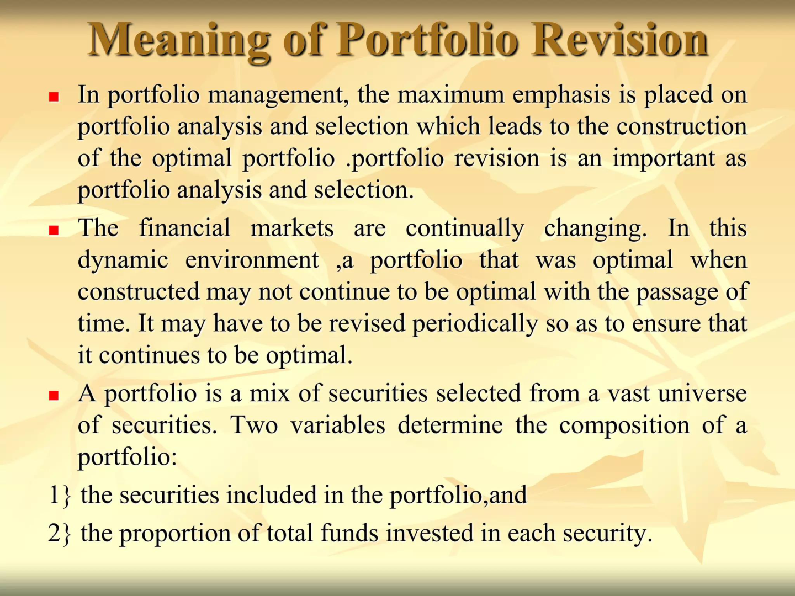
> OCR cue: Meaning of Portfolio Revision = In portfolio management, the maximum emphasis is placed on portfolio analysis and selection which leads to the construction of the optimal portfolio .portfolio revision is an important as portfolio analysis and selection. =» The financial markets are continually changing. In this dynamic environment ,a portfolio that was optimal when constructed may not continue to 

### Figure 3 (Page 3)
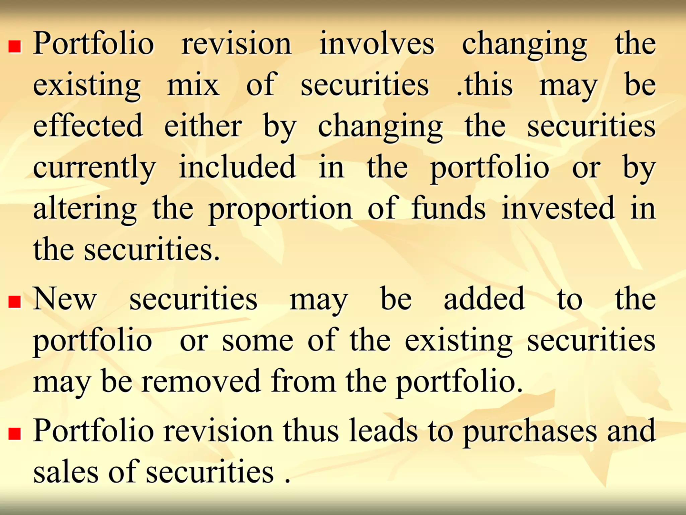
> OCR cue: LE = Portfolio revision involves changing the existing mix of securities .this may be effected either by changing the securities currently included in the portfolio or by altering the proportion of funds invested in the securities. =» New securities may be added to the portfolio or some of the existing securities may be removed from the portfolio. = Portfolio revision thus leads to purchases and s

### Figure 4 (Page 4)
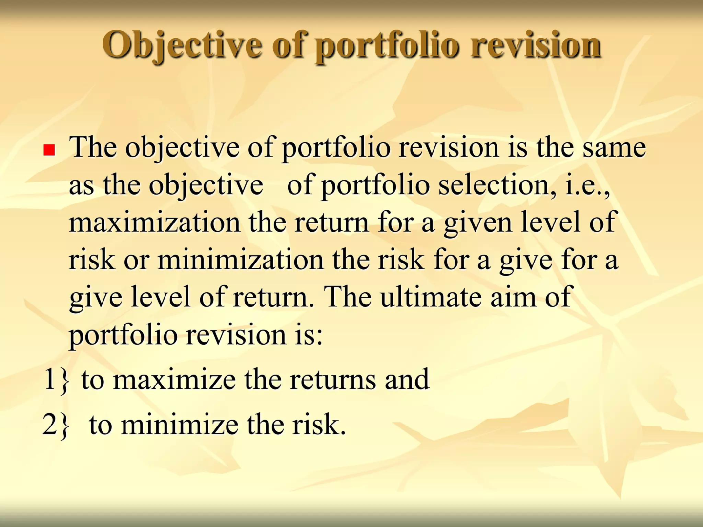
> OCR cue: OO Objective of portfolio revision = The objective of portfolio revision is the same as the objective of portfolio selection, 1.e., maximization the return for a given level of risk or minimization the risk for a give for a give level of return. The ultimate aim of portfolio revision is: 1} to maximize the returns and 2} to minimize the risk.

### Figure 5 (Page 5)
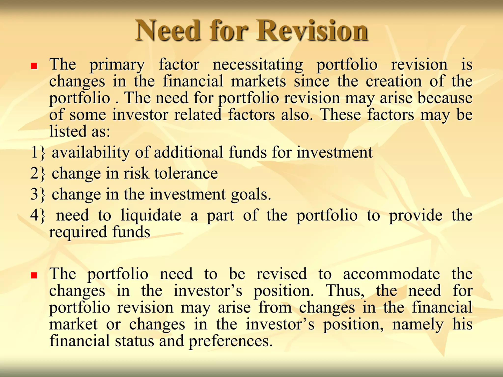
> OCR cue: ee Need for Revision = The primary factor necessitating portfolio revision is changes in the financial markets since the creation of the portfolio . The need for portfolio revision may arise because of some investor related factors also. These factors may be listed as: 1} availability of additional funds for investment 2\ change in risk tolerance 3} change in the investment goals. 4} need to liqui

### Figure 6 (Page 6)
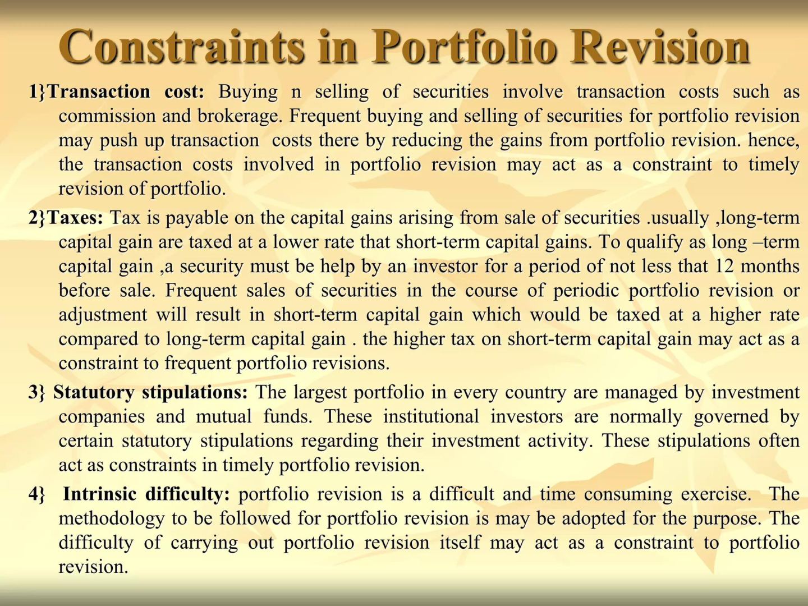
> OCR cue: Constraints in Portfolio Revision 1}Transaction cost: Buying n selling of securities involve transaction costs such as commission and brokerage. Frequent buying and selling of securities for portfolio revision may push up transaction costs there by reducing the gains from portfolio revision. hence, the transaction costs involved in portfolio revision may act as a constraint to timely revision of p

### Figure 7 (Page 7)

> OCR cue: Two different strategies may be adopted for portfolio revision which are as follows: 1}Active Revision Strategy 2}Passive Revision Strategy

### Figure 8 (Page 8)
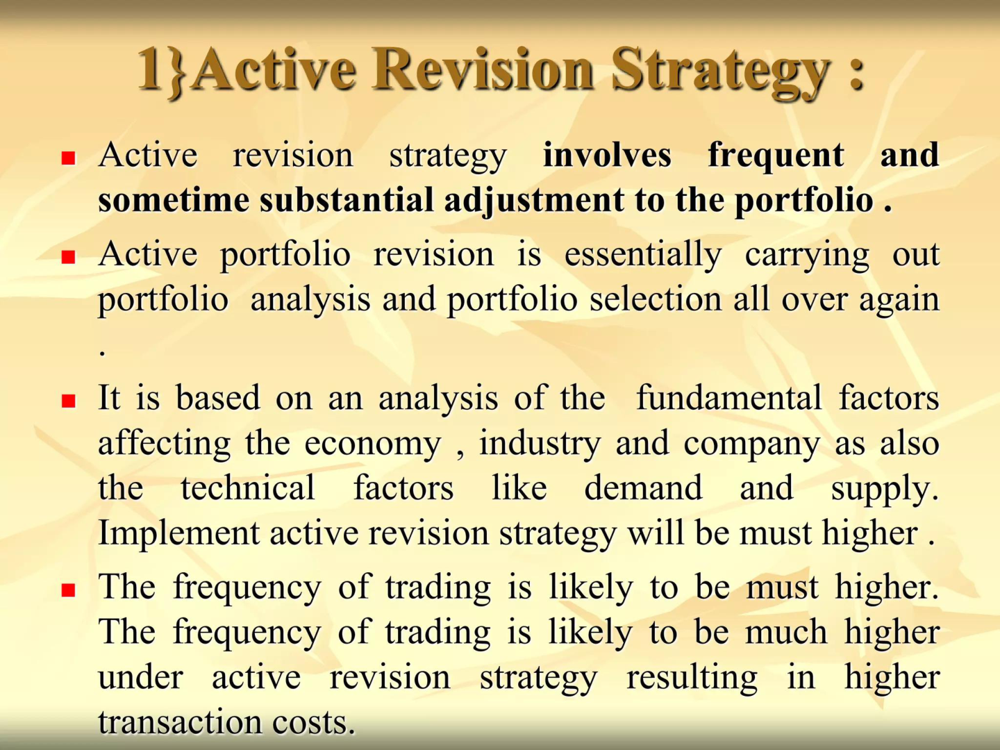
> OCR cue: 1}Active Revision Strategy : =» Active revision strategy involves frequent and sometime substantial adjustment to the portfolio . = Active portfolio revision is essentially carrying out portfolio analysis and portfolio selection all over again = It is based on an analysis of the fundamental factors affecting the economy , industry and company as also the technical factors like demand and _ supply.

### Figure 9 (Page 9)
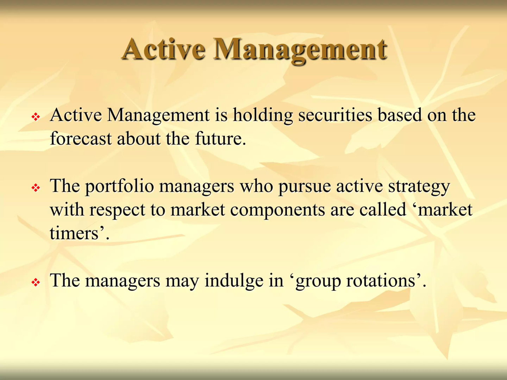
> OCR cue: Active Management « Active Management is holding securities based on the forecast about the future. « The portfolio managers who pursue active strategy with respect to market components are called ‘market timers’. « The managers may indulge in ‘group rotations’.

### Figure 10 (Page 10)
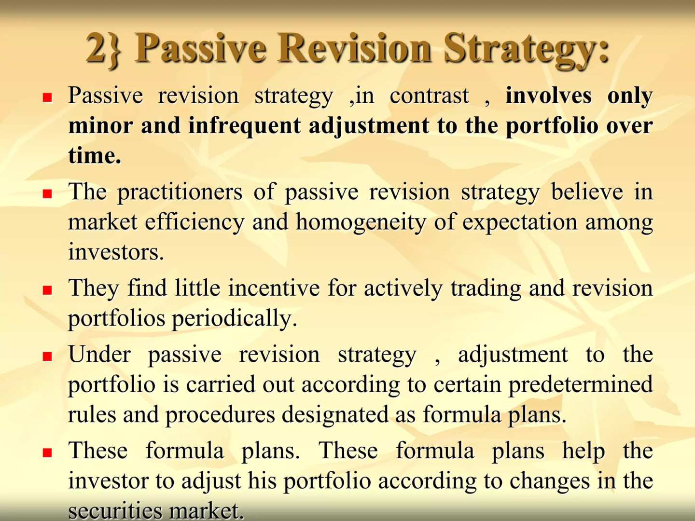
> OCR cue: ee 2} Passive Revision Strategy: = Passive revision strategy ,in contrast , involves only minor and infrequent adjustment to the portfolio over time. = The practitioners of passive revision strategy believe in market efficiency and homogeneity of expectation among investors. = They find little incentive for actively trading and revision portfolios periodically. =» Under passive revision strategy ,

### Figure 11 (Page 11)
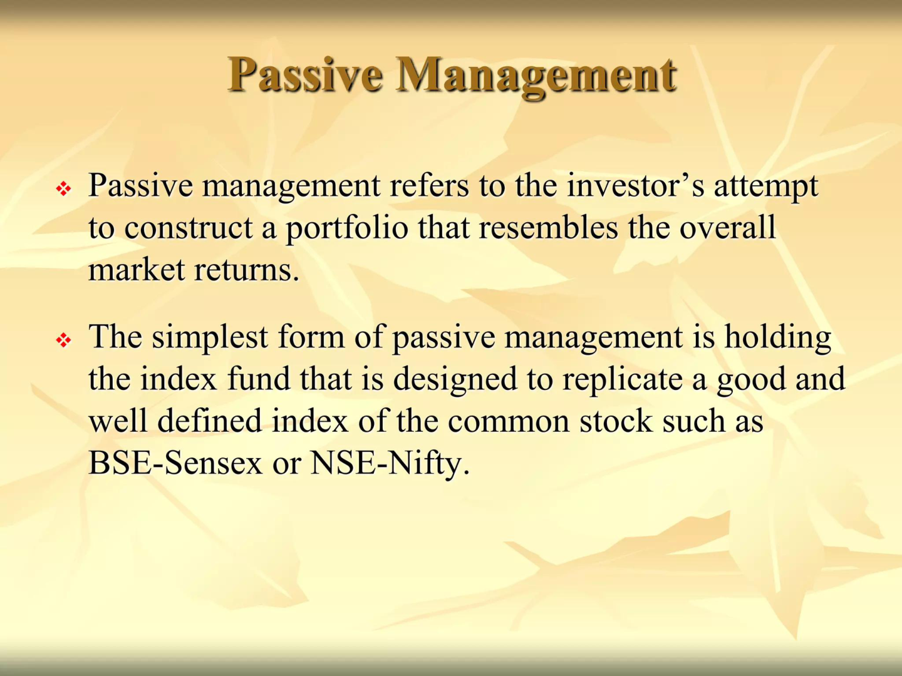
> OCR cue: OO Passive Management « Passive management refers to the investor’s attempt to construct a portfolio that resembles the overall market returns. « The simplest form of passive management is holding the index fund that is designed to replicate a good and well defined index of the common stock such as BSE-Sensex or NSE-Nifty.

### Figure 12 (Page 12)
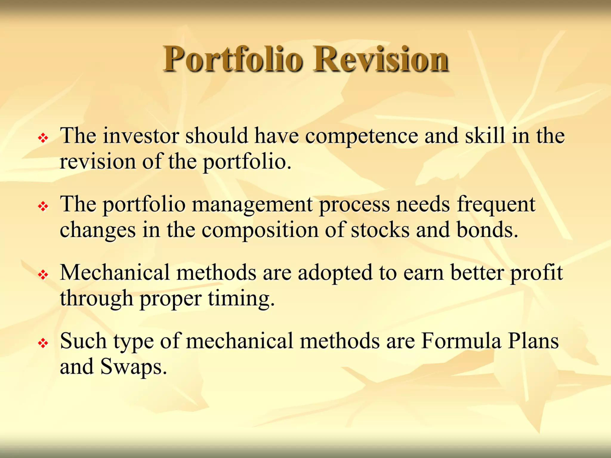
> OCR cue: LSS SS... Portfolio Revision « The investor should have competence and skill in the revision of the portfolio. « The portfolio management process needs frequent changes in the composition of stocks and bonds. « Mechanical methods are adopted to earn better profit through proper timing. « Such type of mechanical methods are Formula Plans and Swaps.

## UNIT 6/2 Sharpe, Treynor and Jensen.docx
### Figure 1 (Image)
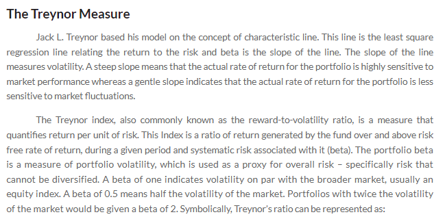
> OCR cue: The Treynor Measure Jack L. Treynor based his model on the concept of characteristic line. This line is the least square regression line relating the return to the risk and beta is the slope of the line. The slope of the line measures volatility. A steep slope means that the actual rate of return for the portfolio is highly sensitive to market performance whereas a gentle slope indicates that the 

### Figure 2 (Image)
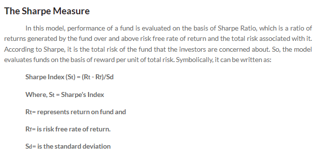
> OCR cue: The Sharpe Measure In this model, performance of a fund is evaluated on the basis of Sharpe Ratio, which is a ratio of returns generated by the fund over and above risk free rate of return and the total risk associated with it According to Sharpe, itis the total risk of the fund that the investors are concerned about. So, the model evaluates funds on the basis of reward per unit of total risk. Sym

### Figure 3 (Image)
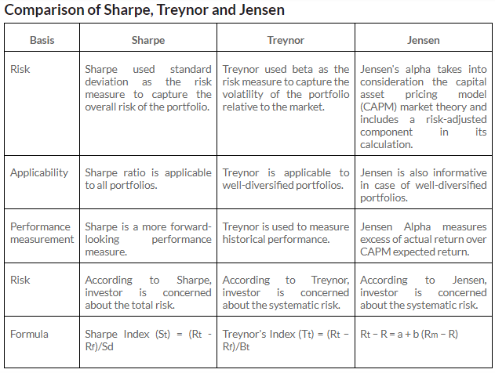
> OCR cue: Comparison of Sharpe, Treynor and Jensen Basis Sharpe Treynor Jensen Risk Sharpe used _ standard deviation as the risk measure to capture the overall risk of the portfolio. ‘Treynor used beta as the risk measure to capture the volatility of the portfolio relative to the market. Jensen's alpha takes into consideration the capital asset pricing model (CAPM) market theory and includes a risk-adjusted

### Figure 4 (Image)
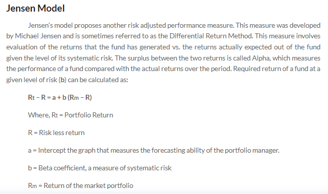
> OCR cue: Jensen Model Jensen's model proposes another risk adjusted performance measure. This measure was developed by Michael Jensen and is sometimes referred to as the Differential Return Method. This measure involves evaluation of the returns that the fund has generated vs. the returns actually expected out of the fund given the level of its systematic risk. The surplus between the two returns is called

### Figure 5 (Image)
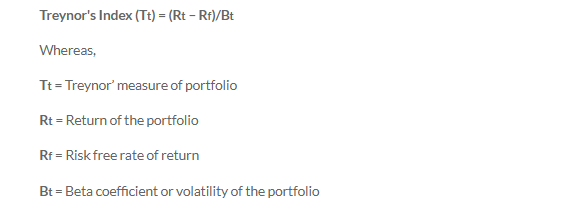
> OCR cue: Treynor's Index (Tt) = (Rt - Re)/Bt Whereas, ‘Tt=Treynor’ measure of portfolio Rt= Return of the portfolio Rr= Risk free rate of return Bt= Beta coefficient or volatility of the portfolio

## UNIT 6/2.2 Numericals Sharpe, Treynor, Jensen.pdf
### Figure 1 (Page 1)
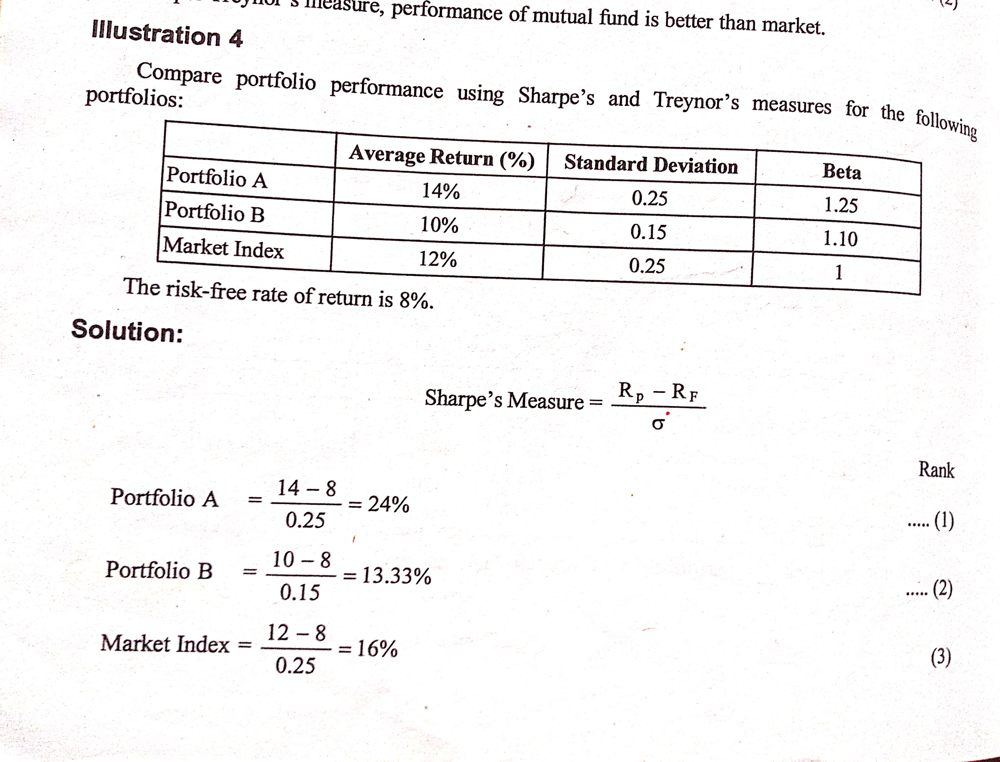
> OCR cue: eh ead nie EN ESNTE, Performance of mutual fund is better than market. lllustration 4 | ; Compare portfolios: 2 : * Average Return (%) | Standard Deviation The risk-free rate of return is 8%. portfolio Performance using Sharpe’s and Treynor’s measures for the follow: Wing a $ fo) > S E a a is Solution: Sharpe’s Measure = Rp oR oO Rank Portfolio A = = = 249%, Ea Sate | ahaa (1) PortfolioB = 7 — = 1

### Figure 2 (Page 2)
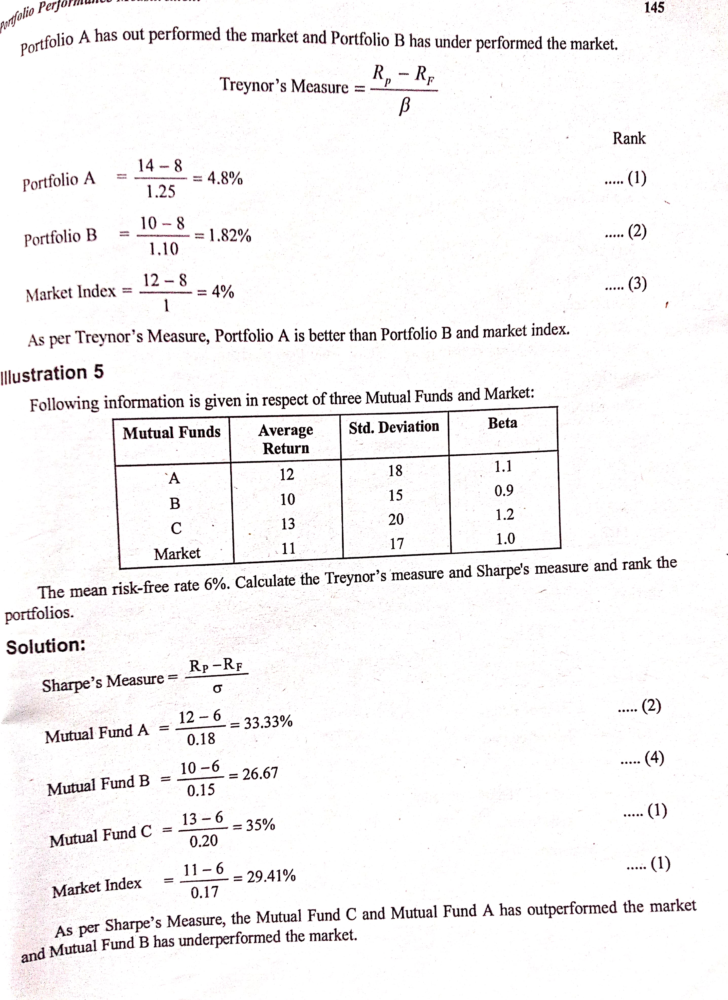
> OCR cue: 1io0 A has out performed t 145 postfo P ned the market and Portfolio B has under performed the mark | ae e market. Treynor’s Measure = Ky 7 Re i Rank portfolio A = “ = = 4.8% Cees ei. eC cr a ra (1) Portfolio B = 10-8 = 1.82% TAOce er ne otek ee pe ee. iceman eG te (2) Market Index = 1278 . gy, 1 sO ae (3) As per Treynor’s Measure, Portfolio A is better than Portfolio B and market ‘dex: illustrati

### Figure 3 (Page 3)
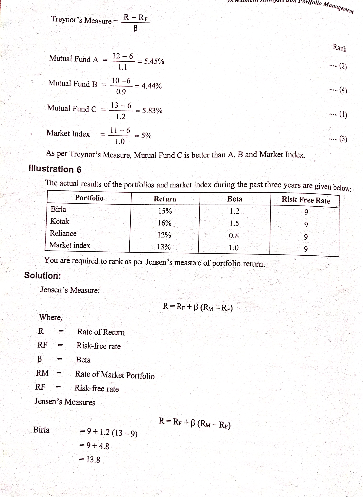
> OCR cue: BLE VOCOESIERTEE £BEENOE TED SIEM t OFtfolig Ma Treynor’s Measure sr Rank ) | 4126 Mutual Fund A = — SRO BS ata wg te a Sane & Fae (2) : _ 10-6 Mutual FundB=——" 24.44% (4) 0.9 13 —6 Mutual Fund C = Tad DR A Cee ent ert (1) : 11-6 Market Index = 7 SO Pg gitar.” Bh Re, oe eee sels ee (3) As per Treynor’s Measure, Mutual Fund C is better than A, B and Market Index. illustration 6 The actual results o

### Figure 4 (Page 4)
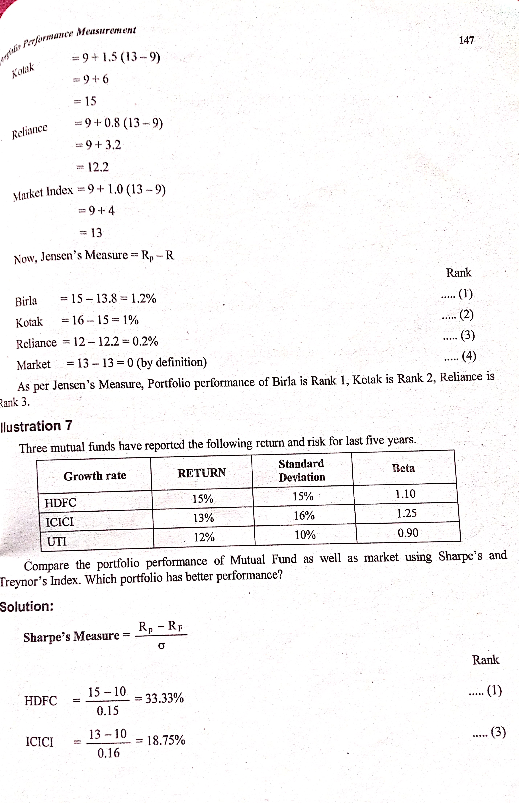
> OCR cue: y 7) vasurement " pf Ad Afe 1” perfor 147 iil =9+1.5 (13-9) cotitk . =O+6 = 15 | reliance =9+0.8 (13-9) =9+3.2 = 12.2 Market Index = 9 + 1.0 (13 —9) =9+4 =13 Now, Jensen’s Measure = Rp — R Rank pirla = = 15-13.8=12% _ peta eat: (1) Kotak =16-15=1% | ue) Reliance =12—-12.2=0.2% ES a (3). Market =13—13=0 (by definition) 3 | ah ee he ae (4) As per Jensen’s Measure, Portfolio performance of Birla is R

### Figure 5 (Page 5)
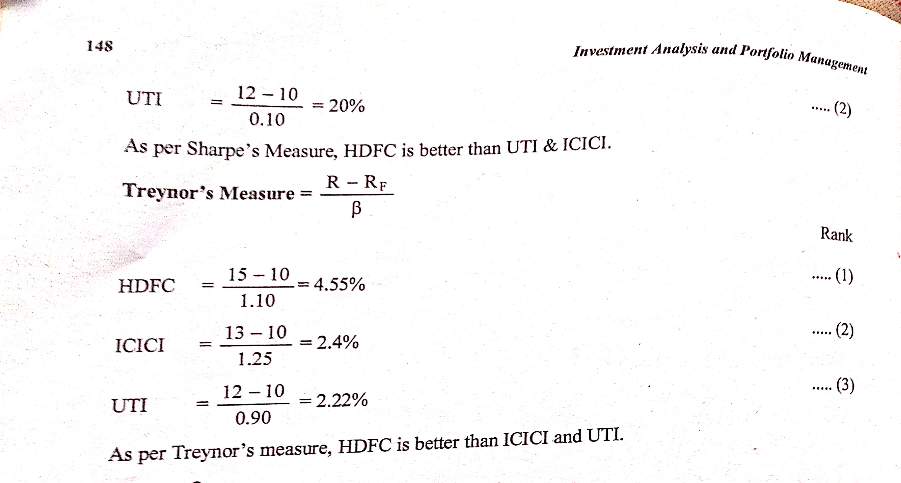
> OCR cue: 148 Investment Analysis and Portfolig Managen eheny 9 te TO tae 0.10 nee | vv (2) As per Sharpe’s Measure, HDFC is better than UTI & ICICI. Treynor’s Measure = SBE. B Rank HDFC = a = 4.55% di. (1) ICICI = a oy igs ee aE Rag a eh ge Ep (2) $F TO oSee BO es ET et peg Es oor (3) x. Ss 9M 0.90 As per Treynor’s measure, HDEC is better than ICICI and UTI.

## UNIT 6/3 Foreign Exchange Risk.pdf
### Figure 1 (Page 1)

> OCR cue: Foreign exchange risk Foreign exchange risk, also known as currency risk, exchange rate risk, or FX risk, is the financial risk that ; arises when a company or individual engages in financial transactions denominated in a foreign currency. This risk stems from the uncertainty of future exchange rates, which can significantly impact the value of these transactions.

### Figure 2 (Page 2)
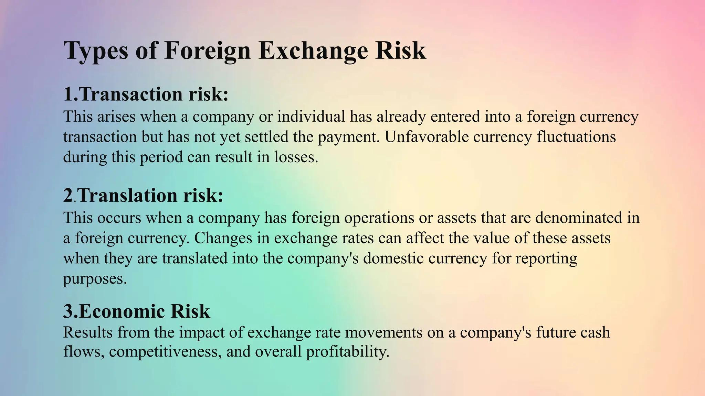
> OCR cue: Types of Foreign Exchange Risk 1.Transaction risk: This arises when a company or individual has already entered into a foreign currency transaction but has not yet settled the payment. Unfavorable currency fluctuations during this period can result in losses. 2.Translation risk: This occurs when a company has foreign operations or assets that are denominated in a foreign currency. Changes in excha

### Figure 3 (Page 6)

> OCR cue: Factors Affecting Foreign Exchange Risk: 1.Exchange Rate Fluctuations- <= The constant changes in exchange rates due to supply and demand in the international currency markets. EXCHANGE RATE FLUCTUATIONS Realized vol of G7 28 3m realized FX vot 2.Market Volatility- The degree of price variability in the foreign exchange market, impacted by economic and political developments. 3. Political and Econ

### Figure 4 (Page 7)

> OCR cue: Methods to Mitigate Foreign Exchange Risk 1 Hedging Strategies Using financial instruments like forward contracts, options, and futures to lock in exchange rates and protect against adverse movements. 2 Diversification of Currency Exposure Spreading business activities across different currency areas to reduce reliance on a single currency and decrease risk. 3. Using Financial Derivatives Utilizin

### Figure 5 (Page 8)

> OCR cue: Company X's Approach to Managing Foreign Exchange Risk Company X, a global manufacturer, successfully mitigates foreign exchange risk through a combination of hedging strategies, diversification of currency exposure, and leveraging financial derivatives.

### Figure 6 (Page 9)
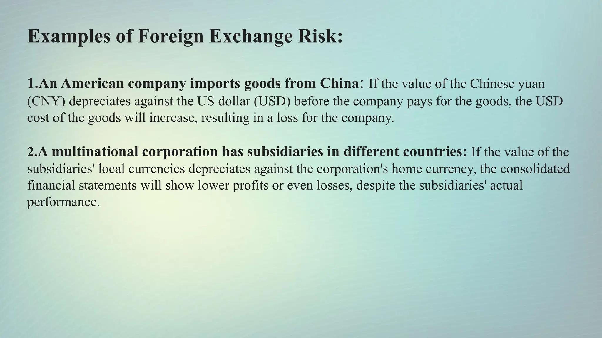
> OCR cue: Examples of Foreign Exchange Risk: 1.An American company imports goods from China: If the value of the Chinese yuan (CNY) depreciates against the US dollar (USD) before the company pays for the goods, the USD cost of the goods will increase, resulting in a loss for the company. 2.A multinational corporation has subsidiaries in different countries: If the value of the subsidiaries' local currencies

### Figure 7 (Page 10)
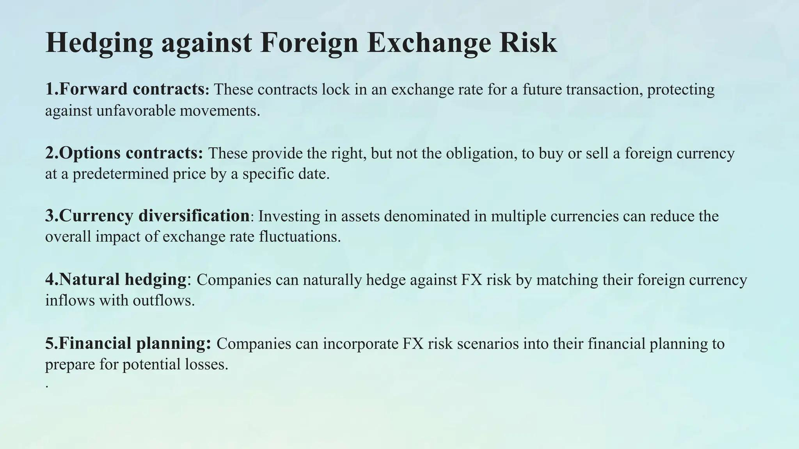
> OCR cue: Hedging against Foreign Exchange Risk 1.Forward contracts: These contracts lock in an exchange rate for a future transaction, protecting against unfavorable movements. 2.Options contracts: These provide the right, but not the obligation, to buy or sell a foreign currency at a predetermined price by a specific date. 3.Currency diversification: Investing in assets denominated in multiple currencies 

### Figure 8 (Page 11)
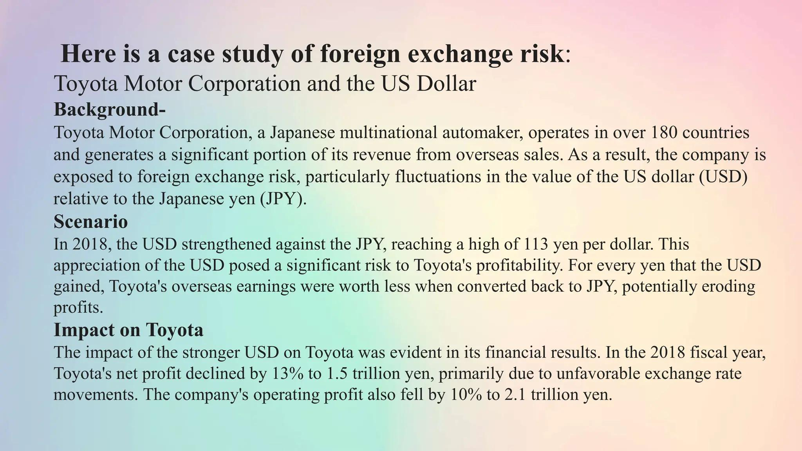
> OCR cue: Here is a case study of foreign exchange risk: Toyota Motor Corporation and the US Dollar Background- Toyota Motor Corporation, a Japanese multinational automaker, operates in over 180 countries and generates a significant portion of its revenue from overseas sales. As a result, the company is exposed to foreign exchange risk, particularly fluctuations in the value of the US dollar (USD) relative 

### Figure 9 (Page 12)
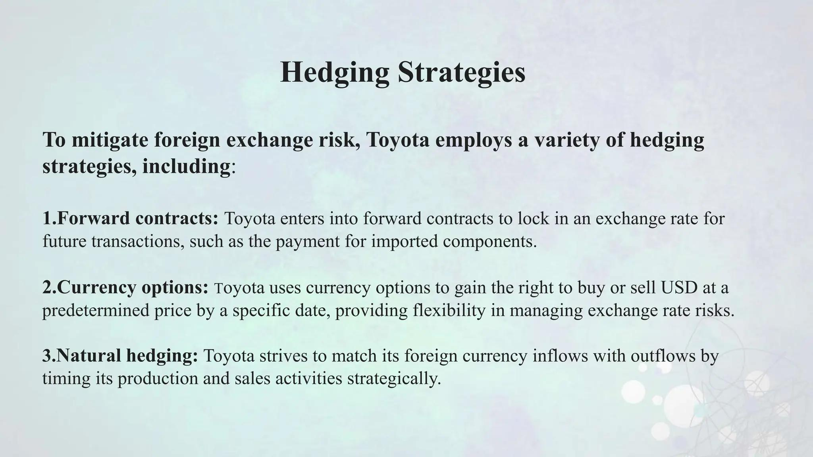
> OCR cue: Hedging Strategies To mitigate foreign exchange risk, Toyota employs a variety of hedging strategies, including: 1.Forward contracts: Toyota enters into forward contracts to lock in an exchange rate for future transactions, such as the payment for imported components. 2.Currency options: Toyota uses currency options to gain the right to buy or sell USD at a predetermined price by a specific date, 

### Figure 10 (Page 13)
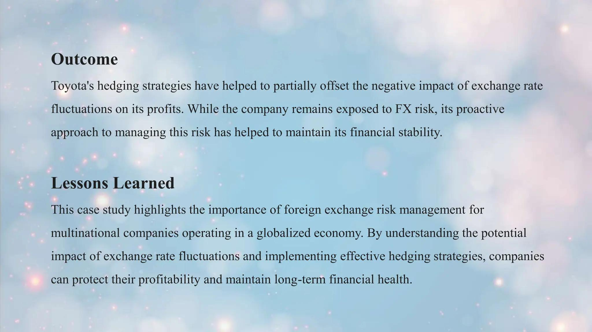
> OCR cue: Outcome Toyota's hedging strategies have helped to partially offset the negative impact of exchange rate fluctuations on its profits. While the company remains exposed to FX risk, its proactive approach to managing this risk has helped to maintain its financial stability. Lessons Learned This case study highlights the importance of foreign exchange risk management for multinational companies opera

### Figure 11 (Page 14)
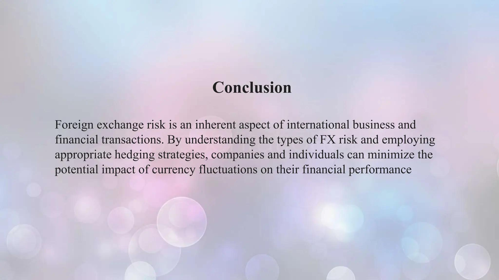
> OCR cue: Conclusion Foreign exchange risk is an inherent aspect of international business and financial transactions. By understanding the types of FX risk and employing appropriate hedging strategies, companies and individuals can minimize the potential impact of currency fluctuations on their financial performance

## UNIT 6/4 Bond Strategy.pptx
### Figure 1 (Slide 1)

### Figure 2 (Slide 3)
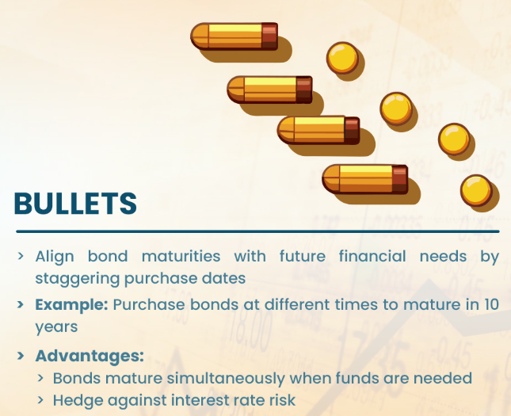
> OCR cue: > Align bond maturities with future financial needs by staggering purchase dates BULLETS > Example: Purchase bonds at different times to mature in 10 years > Advantages: > Bonds mature simultaneously when funds are needed > Hedge against interest rate risk

### Figure 3 (Slide 5)
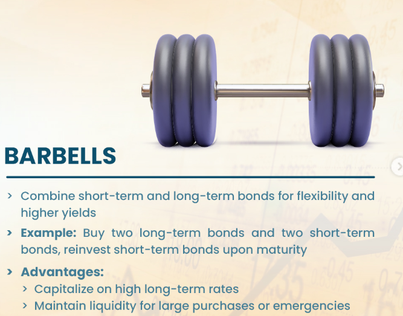
> OCR cue: BARBELLS > Combine short-term and long-term bonds for flexibility and higher yields >» Example: Buy two long-term bonds and two short-term bonds, reinvest short-term bonds upon maturity > Advantages: > Capitalize on high long-term rates > Maintain liquidity for large purchases or emergencies

### Figure 4 (Slide 7)
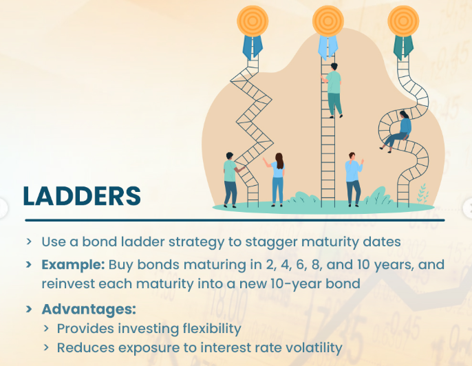
> OCR cue: LADDERS > Use a bond ladder strategy to stagger maturity dates > Example: Buy bonds maturing in 2, 4, 6, 8, and 10 years, and reinvest each maturity into a new 10-year bond > Advantages: > Provides investing flexibility > Reduces exposure to interest rate volatility

### Figure 5 (Slide 9)

> OCR cue: ccccccccc ee o—_— CONCLUSION > Implement ladders, barbells, and bullets to diversify your bond portfolio effectively > Assess your investment goals and select the strategy that best fits your needs

## UNIT 6/4 Hedging.pptx
### Figure 1 (Slide 4)
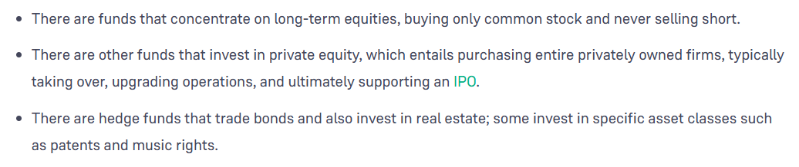
> OCR cue: © There are funds that concentrate on long-term equities, buying only common stock and never selling short. © There are other funds that invest in private equity, which entails purchasing entire privately owned firms, typically taking over, upgrading operations, and ultimately supporting an IPO. © There are hedge funds that trade bonds and also invest in real estate; some invest in specific asset 

### Figure 2 (Slide 5)
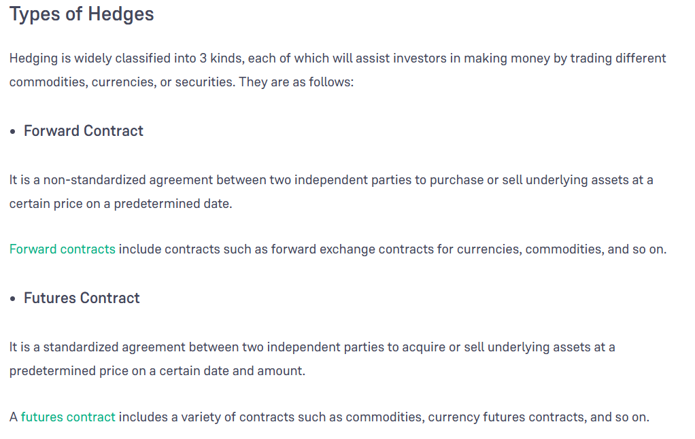
> OCR cue: Types of Hedges Hedging is widely classified into 3 kinds, each of which will assist investors in making money by trading different commodities, currencies, or securities. They are as follows: ¢ Forward Contract It is a non-standardized agreement between two independent parties to purchase or sell underlying assets at a certain price on a predetermined date. Forward contracts include contracts suc

### Figure 3 (Slide 6)
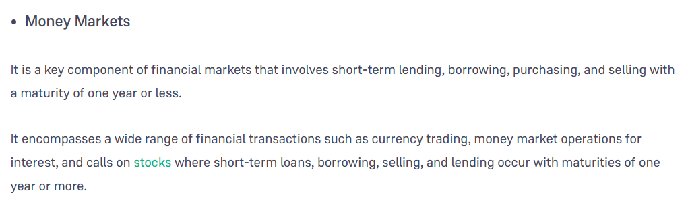
> OCR cue: ¢ Money Markets It is a key component of financial markets that involves short-term lending, borrowing, purchasing, and selling with a maturity of one year or less. It encompasses a wide range of financial transactions such as currency trading, money market operations for interest, and calls on stocks where short-term loans, borrowing, selling, and lending occur with maturities of one year or more

### Figure 4 (Slide 7)
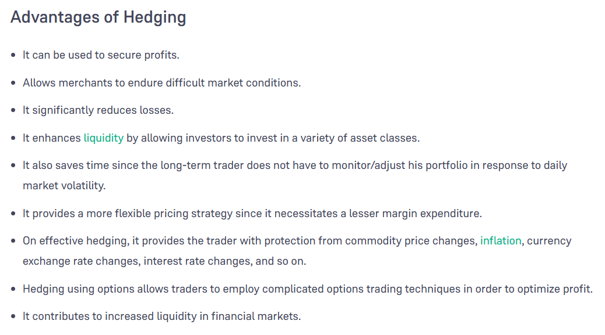
> OCR cue: Advantages of Hedging It can be used to secure profits. Allows merchants to endure difficult market conditions. It significantly reduces losses. It enhances liquidity by allowing investors to invest in a variety of asset classes. It also saves time since the long-term trader does not have to monitor/adjust his portfolio in response to daily market volatility. It provides a more flexible pricing st

### Figure 5 (Slide 8)
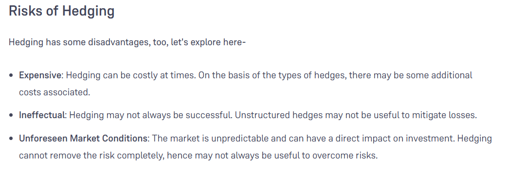
> OCR cue: Risks of Hedging Hedging has some disadvantages, too, let's explore here- e Expensive: Hedging can be costly at times. On the basis of the types of hedges, there may be some additional costs associated. ¢ Ineffectual: Hedging may not always be successful. Unstructured hedges may not be useful to mitigate losses. e Unforeseen Market Conditions: The market is unpredictable and can have a direct impa

### Figure 6 (Slide 9)
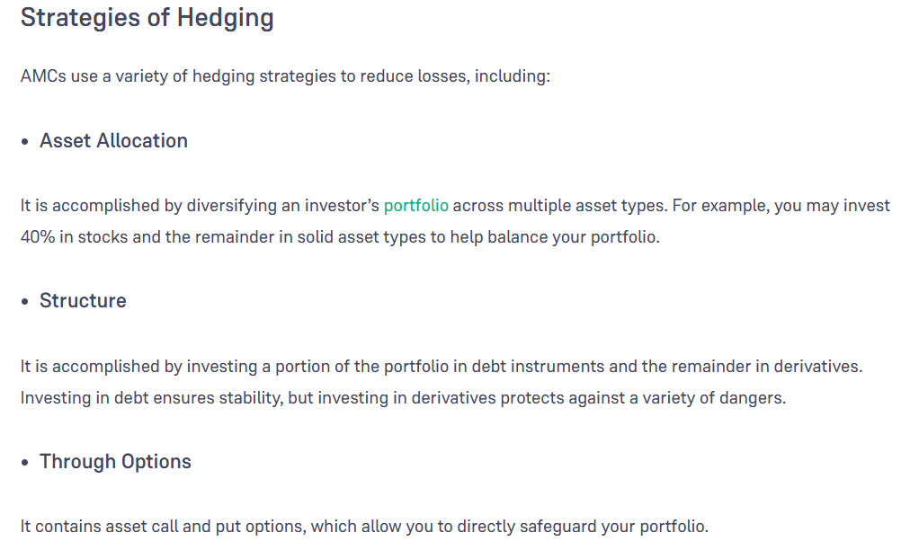
> OCR cue: Strategies of Hedging AMCs use a variety of hedging strategies to reduce losses, including: ¢ Asset Allocation It is accomplished by diversifying an investor’s portfolio across multiple asset types. For example, you may invest 40% in stocks and the remainder in solid asset types to help balance your portfolio. ¢ Structure It is accomplished by investing a portion of the portfolio in debt instrumen

### Figure 7 (Slide 10)
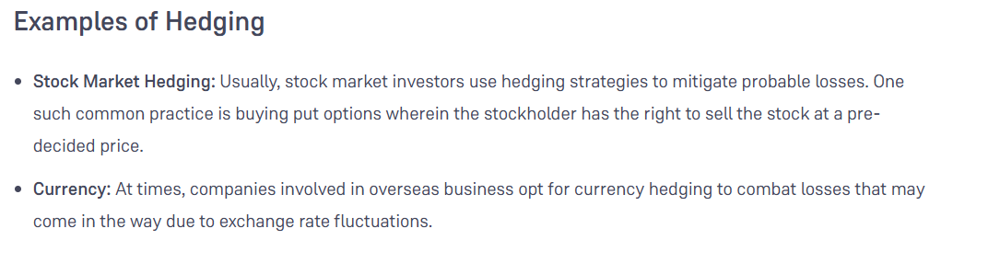
> OCR cue: Examples of Hedging * Stock Market Hedging: Usually, stock market investors use hedging strategies to mitigate probable losses. One such common practice is buying put options wherein the stockholder has the right to sell the stock at a pre- decided price. Currency: At times, companies involved in overseas business opt for currency hedging to combat losses that may come in the way due to exchange r

